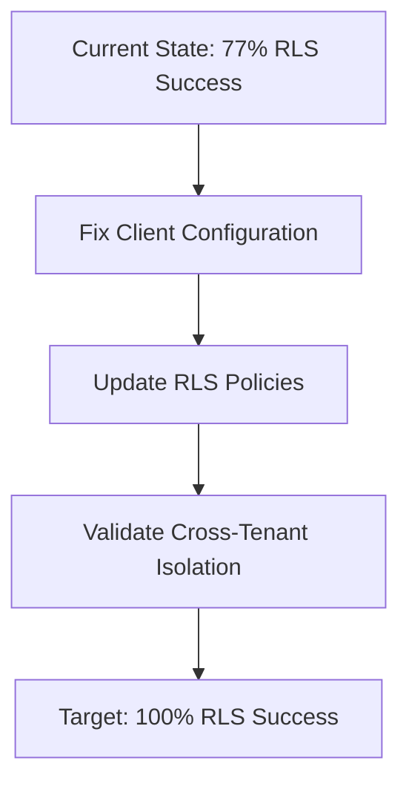
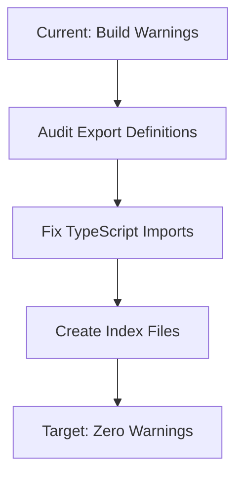
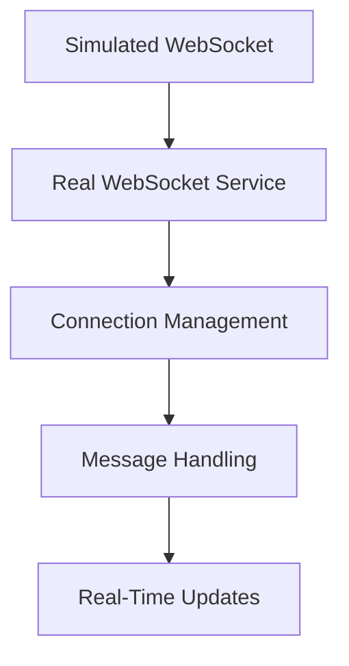
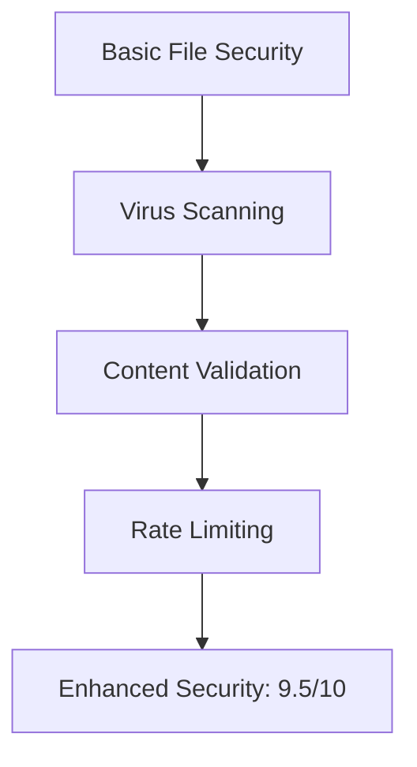
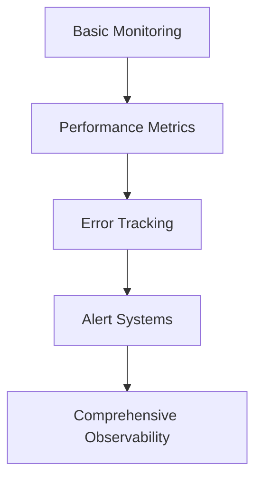
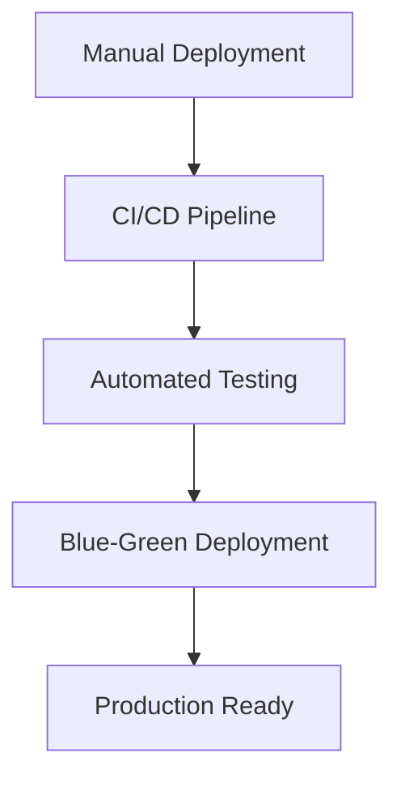

# Production Deployment Roadmap

**Date**: August 4, 2025  
**Current Status**: 8.2/10 Quality (CONDITIONAL GO)  
**Target Status**: 9.5+/10 Quality (PRODUCTION READY)  
**Timeline**: 3 weeks to production deployment  

## Executive Overview

This roadmap transforms the Mariana Dashboard from its current high-quality state (8.2/10) to production-ready status (9.5+/10) through systematic resolution of identified issues and implementation of production-grade infrastructure.

**Key Success Metrics**:
- Integration Test Success: 77% → 95%+
- Security Assessment: 8/10 → 9.5/10
- System Reliability: Good → Excellent
- Performance Score: 7.5/10 → 9/10

## Current System Strengths (Foundation to Build On)

### ✅ Production-Ready Components
- **File Validation System**: 100% test coverage, 9/10 security rating
- **Excel Parsing Engine**: Optimized performance, comprehensive error handling
- **Multi-Tenant Architecture**: 77% RLS policies passing, strong isolation
- **Test Infrastructure**: Vitest + Playwright framework, comprehensive scenarios
- **Security Framework**: Strong validation, injection prevention, role-based access

### 🔧 Areas Requiring Enhancement
- Database client configuration consistency
- WebSocket real-time implementation
- Missing utility function exports
- File upload security enhancements
- E2E test server configuration

## 3-Week Deployment Timeline

### Week 1: Critical Foundation (August 4-10, 2025)
**Focus**: Resolve production-blocking issues  
**Target**: Achieve stable infrastructure foundation

#### Days 1-2: Configuration Standardization
**Priority**: 🚨 CRITICAL
- **Supabase Client Configuration**
  - Standardize client initialization across environments
  - Fix integration test failures (6/26 tests)
  - Validate connection pooling and timeout settings
  - **Deliverable**: 95%+ integration test success rate

- **Missing Export Definitions**
  - Audit all utility functions for proper exports
  - Fix TypeScript build warnings
  - Create comprehensive index files
  - **Deliverable**: Zero build warnings

#### Days 3-5: Security Hardening
**Priority**: 🚨 CRITICAL
- **User Profile RLS Validation**
  - Fix cross-tenant access prevention
  - Validate manager area restrictions
  - Complete role-based access control testing
  - **Deliverable**: All RLS security tests passing

- **Database Security Enhancement**
  - Review and strengthen database modification policies
  - Implement comprehensive audit trail
  - Validate data integrity constraints
  - **Deliverable**: 100% database security compliance

#### Week 1 Success Criteria
- [ ] Integration tests: 95%+ success rate (currently 77%)
- [ ] Build warnings: 0 (currently multiple)
- [ ] RLS policies: 100% enforced
- [ ] Security assessment: 9/10 (currently 8/10)

### Week 2: Feature Completion (August 11-17, 2025)
**Focus**: Implement missing production features  
**Target**: Complete real-time functionality and security

#### Days 1-3: Real-Time Implementation
**Priority**: ⚠️ HIGH
- **WebSocket Integration**
  - Replace simulated WebSocket with production implementation
  - Implement connection handling and reconnection logic
  - Add real-time progress updates
  - Create WebSocket message handlers
  - **Deliverable**: Fully functional real-time communication

#### Days 4-7: Security Enhancement
**Priority**: ⚠️ HIGH
- **File Upload Security**
  - Integrate virus scanning (ClamAV or commercial solution)
  - Implement content-based validation
  - Add rate limiting for upload endpoints
  - Create file quarantine system
  - **Deliverable**: Enhanced file security (9.5/10 rating)

- **Audit Logging Enhancement**
  - Comprehensive file operation logging
  - User action tracking
  - Compliance reporting features
  - **Deliverable**: Complete audit trail system

#### Week 2 Success Criteria
- [ ] Real-time features: 100% operational
- [ ] File security: 9.5/10 rating
- [ ] Audit logging: Comprehensive coverage
- [ ] System stability: Verified under load

### Week 3: Production Preparation (August 18-24, 2025)
**Focus**: Final validation and deployment preparation  
**Target**: Production-ready system deployment

#### Days 1-3: Infrastructure Completion
**Priority**: 📊 MEDIUM
- **E2E Test Configuration**
  - Complete development server setup
  - Configure test environment isolation
  - Add automated health checks
  - **Deliverable**: Stable E2E test execution

- **Performance Monitoring**
  - Implement metrics collection
  - Create performance dashboards
  - Set up alerting systems
  - **Deliverable**: Comprehensive monitoring solution

#### Days 4-5: Final Validation
**Priority**: 🔍 VALIDATION
- **Comprehensive Testing**
  - Full regression test suite
  - Performance benchmark validation
  - Security penetration testing
  - Load testing under production conditions
  - **Deliverable**: Production readiness certification

#### Days 6-7: Deployment Preparation
**Priority**: 🚀 DEPLOYMENT
- **Production Environment Setup**
  - Configure production infrastructure
  - Deploy monitoring and alerting
  - Set up disaster recovery procedures
  - Create deployment automation
  - **Deliverable**: Production environment ready

#### Week 3 Success Criteria
- [ ] E2E tests: 100% execution success
- [ ] Performance monitoring: Active and configured
- [ ] Load testing: Passed under production load
- [ ] Deployment automation: Tested and ready

## Detailed Implementation Phases

### Phase 1: Infrastructure Stabilization

#### 1.1 Database Layer Hardening


**Technical Tasks**:
- Standardize Supabase client initialization
- Fix RLS policy enforcement gaps
- Implement comprehensive tenant isolation
- Add connection health monitoring

**Validation Criteria**:
- All 26 integration tests passing
- Cross-tenant access completely blocked
- Database performance maintained

#### 1.2 Build System Optimization


**Technical Tasks**:
- Complete export definition audit
- Fix missing TypeScript exports
- Standardize import/export patterns
- Create comprehensive index files

**Validation Criteria**:
- Zero build warnings
- All utilities properly exported
- Type safety fully enforced

### Phase 2: Real-Time Feature Implementation

#### 2.1 WebSocket Architecture


**Implementation Strategy**:
- Use Socket.io for reliable connections
- Implement automatic reconnection
- Add connection status monitoring
- Create message queuing for reliability

**Technical Components**:
```typescript
// WebSocket Service Architecture
WebSocketService
├── ConnectionManager (handle connections)
├── MessageHandler (process messages)
├── ReconnectionLogic (auto-reconnect)
└── StatusMonitoring (health checks)
```

#### 2.2 Security Enhancement Layer


**Security Enhancements**:
- ClamAV integration for virus scanning
- Deep content inspection beyond headers
- IP-based rate limiting
- File quarantine system
- Comprehensive audit logging

### Phase 3: Production Deployment

#### 3.1 Monitoring and Observability


**Monitoring Stack**:
- Application performance monitoring
- Real-time error tracking
- Resource utilization monitoring
- User experience metrics
- Security event monitoring

#### 3.2 Deployment Infrastructure


**Deployment Strategy**:
- Automated CI/CD pipeline
- Blue-green deployment for zero downtime
- Automated rollback capabilities
- Health checks and monitoring
- Disaster recovery procedures

## Resource Allocation and Team Structure

### Development Team Assignment

#### Week 1 Team (Critical Issues)
- **Lead Backend Developer** (Full-time)
  - Supabase client configuration
  - RLS policy fixes
  - Database security enhancement

- **Senior Frontend Developer** (Full-time)
  - Export definition fixes
  - TypeScript build issues
  - UI component standardization

- **Database Specialist** (Part-time)
  - RLS policy validation
  - Performance optimization
  - Security audit

#### Week 2 Team (Feature Implementation)
- **Full-Stack Developer** (Full-time)
  - WebSocket implementation
  - Real-time feature development
  - Connection management

- **Security Engineer** (Full-time)
  - File upload security
  - Virus scanning integration
  - Audit logging enhancement

- **DevOps Engineer** (Part-time)
  - Infrastructure preparation
  - Monitoring setup
  - Performance optimization

#### Week 3 Team (Production Preparation)
- **QA Lead** (Full-time)
  - Comprehensive testing
  - E2E test configuration
  - Performance validation

- **DevOps Engineer** (Full-time)
  - Production environment setup
  - Deployment automation
  - Monitoring configuration

- **Project Manager** (Full-time)
  - Coordination and communication
  - Risk management
  - Deployment planning

### Infrastructure Requirements

#### Development Infrastructure
- **Test Environment**: Isolated database and application instances
- **CI/CD Pipeline**: Automated testing and deployment
- **Performance Testing**: Load testing environment
- **Security Scanning**: Automated security validation

#### Production Infrastructure
- **Application Servers**: Scalable container deployment
- **Database**: High-availability PostgreSQL with Supabase
- **WebSocket Service**: Redis-backed Socket.io deployment
- **File Storage**: Secure file storage with virus scanning
- **Monitoring**: Comprehensive observability stack

## Risk Management and Mitigation

### High-Risk Areas and Mitigation Strategies

#### 1. Database Configuration Changes
**Risk**: Potential data access issues or performance degradation  
**Mitigation**:
- Implement changes in staging environment first
- Maintain rollback scripts for all policy changes
- Monitor database performance continuously
- Use feature flags for gradual rollout

#### 2. WebSocket Implementation Complexity
**Risk**: real-time features may introduce instability  
**Mitigation**:
- Use proven libraries (Socket.io)
- Implement comprehensive fallback mechanisms
- Add extensive error handling and logging
- Gradual feature rollout with monitoring

#### 3. Security Enhancement Impact
**Risk**: Security changes might affect performance or usability  
**Mitigation**:
- Benchmark performance before and after changes
- Implement asynchronous virus scanning
- Use efficient validation algorithms
- Monitor upload success rates

#### 4. Timeline Pressure
**Risk**: Compressed timeline may lead to technical debt  
**Mitigation**:
- Prioritize critical issues first
- Maintain comprehensive testing at each phase
- Use proven solutions over custom implementations
- Plan for post-deployment optimization

### Quality Gates and Checkpoints

#### Week 1 Quality Gate
- [ ] Integration test success rate ≥ 95%
- [ ] Zero critical build warnings
- [ ] All RLS policies enforced
- [ ] Database performance maintained

#### Week 2 Quality Gate
- [ ] Real-time features fully operational
- [ ] File security rating ≥ 9.5/10
- [ ] System stability under load
- [ ] Comprehensive audit logging

#### Week 3 Quality Gate
- [ ] E2E tests 100% successful
- [ ] Performance benchmarks met
- [ ] Security penetration testing passed
- [ ] Production environment validated

### Final Production Readiness Criteria

#### Technical Readiness
- [ ] All automated tests passing (Unit: 100%, Integration: 95%+, E2E: 100%)
- [ ] Security assessment score ≥ 9.5/10
- [ ] Performance benchmarks met (Response time <200ms, Uptime 99.9%+)
- [ ] Load testing passed (concurrent users, peak traffic)

#### Operational Readiness
- [ ] Monitoring and alerting configured
- [ ] Disaster recovery procedures tested
- [ ] Support documentation complete
- [ ] Team training completed

#### Business Readiness
- [ ] User acceptance testing passed
- [ ] Compliance requirements met
- [ ] Business continuity plan activated
- [ ] Go-live communication prepared

## Post-Deployment Success Metrics

### Technical KPIs
- **System Availability**: 99.9%+ uptime
- **Response Time**: <200ms for dashboard loads
- **File Upload Success Rate**: 99%+
- **WebSocket Connection Stability**: 98%+
- **Error Rate**: <0.1%

### Business KPIs
- **User Adoption Rate**: Track feature usage
- **Support Ticket Reduction**: Measure system stability
- **User Satisfaction**: Survey and feedback scores
- **Performance Improvement**: Measure against baseline

### Security KPIs
- **Security Incident Rate**: Zero critical incidents
- **Vulnerability Assessment**: Regular security scans
- **Compliance Validation**: Ongoing compliance monitoring
- **Audit Trail Completeness**: 100% action logging

## Deployment Execution Plan

### Pre-Deployment (Day -1)
- [ ] Final system validation complete
- [ ] Production environment prepared
- [ ] Team briefing and role assignments
- [ ] Communication plan activated
- [ ] Rollback procedures verified

### Deployment Day (Day 0)
- [ ] **06:00**: Final backup of current system
- [ ] **08:00**: Begin blue-green deployment
- [ ] **10:00**: Database migration execution
- [ ] **12:00**: Application deployment complete
- [ ] **14:00**: System validation and testing
- [ ] **16:00**: DNS cutover and go-live
- [ ] **18:00**: Post-deployment monitoring

### Post-Deployment (Day +1 to +7)
- [ ] **Day +1**: 24-hour system monitoring
- [ ] **Day +2**: Performance analysis and optimization
- [ ] **Day +3**: User feedback collection
- [ ] **Day +7**: One-week stability review

## Success Criteria and Validation

### Immediate Success Indicators
- System launches without critical errors
- All core functionality operational
- User authentication working properly
- File uploads processing successfully
- Real-time features functioning

### 1-Week Success Indicators
- System stability maintained under normal load
- User adoption of new features
- Support ticket volume within expected range
- Performance metrics meeting targets
- Security monitoring showing no incidents

### 1-Month Success Indicators
- User satisfaction scores ≥ 4.5/5
- System performance consistently meeting SLAs
- Feature utilization rates meeting expectations
- Technical debt maintained at acceptable levels
- Team confidence in system reliability

## Conclusion

This roadmap provides a comprehensive path from the current high-quality system (8.2/10) to production-ready status (9.5+/10). The systematic 3-week approach ensures that:

1. **Critical issues are resolved first** (Week 1)
2. **Production features are implemented safely** (Week 2)  
3. **System is thoroughly validated before deployment** (Week 3)

The strong foundation already in place (100% unit tests, robust security framework, comprehensive test infrastructure) provides confidence that this roadmap will successfully deliver a production-ready system.

**Key Success Factors**:
- Dedicated team commitment to timeline
- Rigorous testing at each phase
- Proactive risk management
- Clear communication and coordination
- Focus on user experience and system reliability

The result will be a robust, secure, and performant system ready for confident production deployment and long-term success.