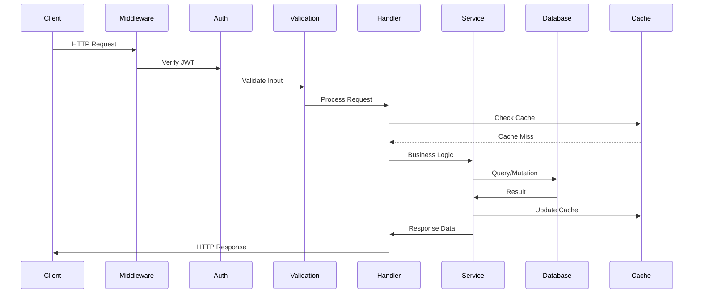
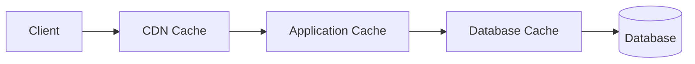
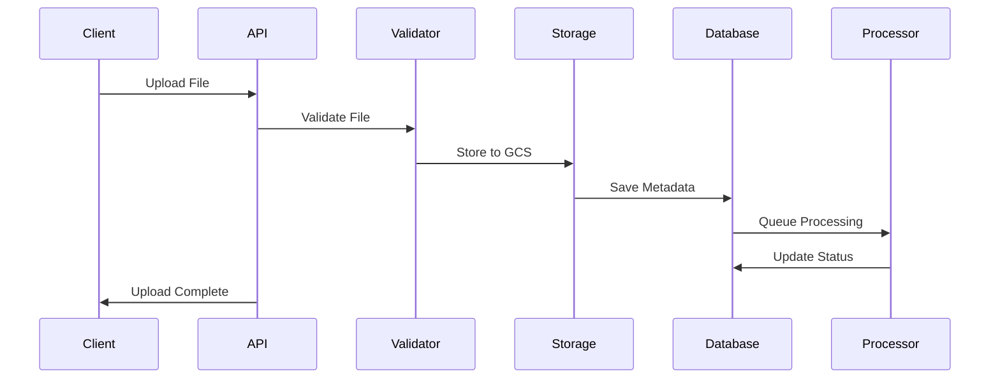

# Backend Architecture

## Overview

The backend architecture leverages Next.js API routes, Supabase platform services, and Google Cloud integrations to provide a scalable, secure, and performant backend for the Initiative Dashboard. The architecture follows RESTful principles with a focus on type safety, security, and maintainability.

## Technology Stack

### Core Technologies
- **Runtime**: Node.js 22.x
- **Framework**: Next.js 15 API Routes
- **Database**: PostgreSQL 15+ (via Supabase)
- **Authentication**: Supabase Auth (JWT-based)
- **Real-time**: Supabase Realtime
- **Storage**: Google Cloud Storage / Supabase Storage
- **Caching**: Redis (optional) + SWR
- **Email**: Brevo (SendinBlue)
- **AI/ML**: Google Gemini API

## API Architecture

### API Route Structure

```
app/api/
├── activities/              # Activity management
├── analytics/               # Analytics endpoints
│   ├── kpi/
│   ├── performance/
│   └── trends/
├── areas/                   # Area management
├── audit-log/               # Audit logging
├── ceo/                     # CEO-specific endpoints
│   ├── metrics/
│   ├── insights/
│   └── strategic-overview/
├── dashboard/               # Dashboard data
├── initiatives/             # Initiative management
├── manager/                 # Manager endpoints
├── objectives/              # Objective management
├── org-admin/               # Organization admin
├── progress-tracking/       # Progress tracking
├── upload/                  # File upload endpoints
└── webhooks/                # Webhook handlers
```

### API Design Principles

1. **RESTful Design**: Standard HTTP methods and status codes
2. **Consistent Naming**: Predictable URL patterns
3. **Versioning Strategy**: Version-less with backward compatibility
4. **Error Handling**: Standardized error responses
5. **Documentation**: OpenAPI/Swagger specifications

## Request Processing Pipeline



## Authentication & Authorization

### Authentication Flow

```typescript
// Authentication middleware pattern
export async function authenticateRequest(
  request: Request
): Promise<AuthResult> {
  const supabase = await createClient()
  
  // Always use getUser() on server-side
  const { data: { user }, error } = await supabase.auth.getUser()
  
  if (error || !user) {
    throw new AuthenticationError('Unauthorized')
  }
  
  // Fetch user profile with role
  const profile = await getUserProfile(supabase, user.id)
  
  if (!profile) {
    throw new AuthenticationError('Profile not found')
  }
  
  return { user, profile }
}
```

### Authorization Patterns

```typescript
// Role-based authorization
interface AuthorizationRules {
  CEO: string[]
  Admin: string[]
  Manager: string[]
}

const permissions: AuthorizationRules = {
  CEO: ['*'],  // Full access
  Admin: ['read:*', 'write:*', 'delete:*'],
  Manager: ['read:own', 'write:own', 'delete:own']
}

// Permission checking
function hasPermission(
  role: UserRole,
  action: string,
  resource: string
): boolean {
  const userPermissions = permissions[role]
  return userPermissions.includes('*') ||
         userPermissions.includes(`${action}:*`) ||
         userPermissions.includes(`${action}:${resource}`)
}
```

## Data Access Layer

### Database Connection Management

```typescript
// Supabase client factory
import { createServerClient } from '@supabase/ssr'

export async function createClient() {
  const cookieStore = await cookies()
  
  return createServerClient(
    process.env.NEXT_PUBLIC_SUPABASE_URL!,
    process.env.NEXT_PUBLIC_SUPABASE_ANON_KEY!,
    {
      cookies: {
        getAll() {
          return cookieStore.getAll()
        },
        setAll(cookiesToSet) {
          cookiesToSet.forEach(({ name, value, options }) => {
            cookieStore.set(name, value, options)
          })
        },
      },
    }
  )
}
```

### Repository Pattern

```typescript
// Example repository implementation
class InitiativeRepository {
  constructor(private supabase: SupabaseClient) {}
  
  async findAll(filters: InitiativeFilters): Promise<Initiative[]> {
    let query = this.supabase
      .from('initiatives')
      .select(`
        *,
        area:areas(*),
        activities(*),
        created_by:user_profiles(*)
      `)
    
    if (filters.areaId) {
      query = query.eq('area_id', filters.areaId)
    }
    
    if (filters.status) {
      query = query.eq('status', filters.status)
    }
    
    const { data, error } = await query
    
    if (error) throw new DatabaseError(error.message)
    
    return data
  }
  
  async create(data: CreateInitiativeDTO): Promise<Initiative> {
    const { data: initiative, error } = await this.supabase
      .from('initiatives')
      .insert(data)
      .select()
      .single()
    
    if (error) throw new DatabaseError(error.message)
    
    return initiative
  }
  
  async update(id: string, data: UpdateInitiativeDTO): Promise<Initiative> {
    const { data: initiative, error } = await this.supabase
      .from('initiatives')
      .update(data)
      .eq('id', id)
      .select()
      .single()
    
    if (error) throw new DatabaseError(error.message)
    
    return initiative
  }
  
  async delete(id: string): Promise<void> {
    const { error } = await this.supabase
      .from('initiatives')
      .delete()
      .eq('id', id)
    
    if (error) throw new DatabaseError(error.message)
  }
}
```

## Service Layer Architecture

### Service Pattern

```typescript
// Business logic service
class InitiativeService {
  constructor(
    private repo: InitiativeRepository,
    private auditLog: AuditLogService,
    private cache: CacheService
  ) {}
  
  async createInitiative(
    data: CreateInitiativeDTO,
    userId: string
  ): Promise<Initiative> {
    // Validate business rules
    await this.validateInitiativeData(data)
    
    // Create initiative
    const initiative = await this.repo.create({
      ...data,
      created_by: userId
    })
    
    // Log audit event
    await this.auditLog.log({
      action: 'create',
      entity: 'initiative',
      entityId: initiative.id,
      userId,
      data: initiative
    })
    
    // Invalidate cache
    await this.cache.invalidate(`initiatives:*`)
    
    return initiative
  }
  
  private async validateInitiativeData(data: CreateInitiativeDTO) {
    // Check for duplicate names
    const existing = await this.repo.findByName(data.title)
    if (existing) {
      throw new ValidationError('Initiative name already exists')
    }
    
    // Validate dates
    if (data.due_date && new Date(data.due_date) < new Date()) {
      throw new ValidationError('Due date must be in the future')
    }
  }
}
```

## Caching Strategy

### Multi-Layer Caching



### Cache Implementation

```typescript
// Redis cache service
class CacheService {
  private redis: Redis
  
  constructor() {
    this.redis = new Redis({
      host: process.env.REDIS_HOST,
      port: process.env.REDIS_PORT,
      password: process.env.REDIS_PASSWORD
    })
  }
  
  async get<T>(key: string): Promise<T | null> {
    const data = await this.redis.get(key)
    return data ? JSON.parse(data) : null
  }
  
  async set<T>(key: string, value: T, ttl?: number): Promise<void> {
    const serialized = JSON.stringify(value)
    if (ttl) {
      await this.redis.setex(key, ttl, serialized)
    } else {
      await this.redis.set(key, serialized)
    }
  }
  
  async invalidate(pattern: string): Promise<void> {
    const keys = await this.redis.keys(pattern)
    if (keys.length > 0) {
      await this.redis.del(...keys)
    }
  }
}

// Cache-aside pattern
async function getCachedData<T>(
  key: string,
  fetcher: () => Promise<T>,
  ttl: number = 3600
): Promise<T> {
  // Try cache first
  const cached = await cache.get<T>(key)
  if (cached) return cached
  
  // Fetch from source
  const data = await fetcher()
  
  // Update cache
  await cache.set(key, data, ttl)
  
  return data
}
```

## File Upload Architecture

### Upload Flow



### File Processing Service

```typescript
// File upload handler
export async function POST(request: Request) {
  const formData = await request.formData()
  const file = formData.get('file') as File
  
  // Validate file
  validateFile(file)
  
  // Generate secure filename
  const filename = generateSecureFilename(file.name)
  
  // Upload to storage
  const url = await uploadToGCS(file, filename)
  
  // Save metadata
  const metadata = await saveFileMetadata({
    originalName: file.name,
    storedName: filename,
    size: file.size,
    mimeType: file.type,
    url
  })
  
  // Queue for processing
  await queueFileProcessing(metadata.id)
  
  return NextResponse.json({ id: metadata.id, url })
}
```

## Real-time Architecture

### WebSocket Management

```typescript
// Real-time subscriptions
class RealtimeService {
  private supabase: SupabaseClient
  private subscriptions: Map<string, RealtimeChannel>
  
  constructor() {
    this.supabase = createClient()
    this.subscriptions = new Map()
  }
  
  subscribeToInitiatives(tenantId: string, callback: Function) {
    const channel = this.supabase
      .channel(`initiatives:${tenantId}`)
      .on(
        'postgres_changes',
        {
          event: '*',
          schema: 'public',
          table: 'initiatives',
          filter: `tenant_id=eq.${tenantId}`
        },
        callback
      )
      .subscribe()
    
    this.subscriptions.set(`initiatives:${tenantId}`, channel)
    
    return () => this.unsubscribe(`initiatives:${tenantId}`)
  }
  
  unsubscribe(key: string) {
    const channel = this.subscriptions.get(key)
    if (channel) {
      channel.unsubscribe()
      this.subscriptions.delete(key)
    }
  }
}
```

## Error Handling

### Error Types

```typescript
// Custom error classes
class AppError extends Error {
  constructor(
    public message: string,
    public statusCode: number,
    public code?: string
  ) {
    super(message)
  }
}

class ValidationError extends AppError {
  constructor(message: string) {
    super(message, 400, 'VALIDATION_ERROR')
  }
}

class AuthenticationError extends AppError {
  constructor(message: string) {
    super(message, 401, 'AUTHENTICATION_ERROR')
  }
}

class AuthorizationError extends AppError {
  constructor(message: string) {
    super(message, 403, 'AUTHORIZATION_ERROR')
  }
}

class NotFoundError extends AppError {
  constructor(message: string) {
    super(message, 404, 'NOT_FOUND')
  }
}

class DatabaseError extends AppError {
  constructor(message: string) {
    super(message, 500, 'DATABASE_ERROR')
  }
}
```

### Global Error Handler

```typescript
// Error handling middleware
export function errorHandler(error: unknown): NextResponse {
  // Log error
  console.error('API Error:', error)
  
  // Handle known errors
  if (error instanceof AppError) {
    return NextResponse.json(
      {
        error: error.message,
        code: error.code
      },
      { status: error.statusCode }
    )
  }
  
  // Handle Supabase errors
  if (isSupabaseError(error)) {
    return NextResponse.json(
      {
        error: 'Database error',
        code: 'DATABASE_ERROR'
      },
      { status: 500 }
    )
  }
  
  // Handle unknown errors
  return NextResponse.json(
    {
      error: 'Internal server error',
      code: 'INTERNAL_ERROR'
    },
    { status: 500 }
  )
}
```

## API Security

### Security Middleware Stack

```typescript
// Security middleware chain
export async function securityMiddleware(request: Request) {
  // CORS validation
  validateCORS(request)
  
  // Rate limiting
  await checkRateLimit(request)
  
  // Input sanitization
  sanitizeInput(request)
  
  // CSRF protection
  validateCSRF(request)
  
  // Authentication
  const auth = await authenticateRequest(request)
  
  return auth
}
```

### Rate Limiting

```typescript
// Rate limiter implementation
class RateLimiter {
  private limits = new Map<string, number[]>()
  
  async checkLimit(
    identifier: string,
    maxRequests: number = 100,
    windowMs: number = 60000
  ): Promise<boolean> {
    const now = Date.now()
    const requests = this.limits.get(identifier) || []
    
    // Remove old requests
    const validRequests = requests.filter(
      time => now - time < windowMs
    )
    
    if (validRequests.length >= maxRequests) {
      return false // Rate limit exceeded
    }
    
    validRequests.push(now)
    this.limits.set(identifier, validRequests)
    
    return true
  }
}
```

## Queue Processing

### Job Queue Architecture

```typescript
// Background job processing
interface Job {
  id: string
  type: string
  payload: any
  attempts: number
  createdAt: Date
}

class JobQueue {
  private queue: Job[] = []
  private processing = false
  
  async enqueue(type: string, payload: any): Promise<string> {
    const job: Job = {
      id: generateId(),
      type,
      payload,
      attempts: 0,
      createdAt: new Date()
    }
    
    this.queue.push(job)
    
    if (!this.processing) {
      this.process()
    }
    
    return job.id
  }
  
  private async process() {
    this.processing = true
    
    while (this.queue.length > 0) {
      const job = this.queue.shift()!
      
      try {
        await this.executeJob(job)
      } catch (error) {
        await this.handleJobError(job, error)
      }
    }
    
    this.processing = false
  }
  
  private async executeJob(job: Job) {
    const handler = jobHandlers[job.type]
    if (!handler) {
      throw new Error(`No handler for job type: ${job.type}`)
    }
    
    await handler(job.payload)
  }
  
  private async handleJobError(job: Job, error: any) {
    job.attempts++
    
    if (job.attempts < 3) {
      // Retry with exponential backoff
      setTimeout(() => {
        this.queue.push(job)
        if (!this.processing) {
          this.process()
        }
      }, Math.pow(2, job.attempts) * 1000)
    } else {
      // Log failed job
      console.error('Job failed after 3 attempts:', job, error)
    }
  }
}
```

## Monitoring & Logging

### Logging Strategy

```typescript
// Structured logging
class Logger {
  log(level: string, message: string, meta?: any) {
    const entry = {
      timestamp: new Date().toISOString(),
      level,
      message,
      ...meta
    }
    
    console.log(JSON.stringify(entry))
    
    // Send to external service
    if (process.env.NODE_ENV === 'production') {
      this.sendToLoggingService(entry)
    }
  }
  
  info(message: string, meta?: any) {
    this.log('info', message, meta)
  }
  
  error(message: string, error?: Error, meta?: any) {
    this.log('error', message, {
      error: {
        message: error?.message,
        stack: error?.stack
      },
      ...meta
    })
  }
}
```

### Performance Monitoring

```typescript
// API performance tracking
export function trackAPIPerformance(
  handler: Function
): Function {
  return async (request: Request) => {
    const start = Date.now()
    const requestId = generateRequestId()
    
    try {
      const response = await handler(request)
      
      const duration = Date.now() - start
      
      // Log performance metrics
      logger.info('API Request', {
        requestId,
        method: request.method,
        url: request.url,
        duration,
        status: response.status
      })
      
      // Add tracking headers
      response.headers.set('X-Request-Id', requestId)
      response.headers.set('X-Response-Time', `${duration}ms`)
      
      return response
    } catch (error) {
      const duration = Date.now() - start
      
      logger.error('API Error', error as Error, {
        requestId,
        method: request.method,
        url: request.url,
        duration
      })
      
      throw error
    }
  }
}
```

## Testing Strategy

### API Testing

```typescript
// API endpoint testing
describe('POST /api/initiatives', () => {
  it('should create initiative with valid data', async () => {
    const response = await fetch('/api/initiatives', {
      method: 'POST',
      headers: {
        'Content-Type': 'application/json',
        'Authorization': `Bearer ${token}`
      },
      body: JSON.stringify({
        title: 'Test Initiative',
        areaId: 'area-123',
        dueDate: '2025-12-31'
      })
    })
    
    expect(response.status).toBe(201)
    const data = await response.json()
    expect(data).toHaveProperty('id')
    expect(data.title).toBe('Test Initiative')
  })
  
  it('should return 400 for invalid data', async () => {
    const response = await fetch('/api/initiatives', {
      method: 'POST',
      headers: {
        'Content-Type': 'application/json',
        'Authorization': `Bearer ${token}`
      },
      body: JSON.stringify({
        // Missing required fields
      })
    })
    
    expect(response.status).toBe(400)
    const error = await response.json()
    expect(error).toHaveProperty('error')
  })
})
```

## Deployment Architecture

### Environment Configuration

```typescript
// Environment-specific configuration
interface Config {
  database: {
    url: string
    poolSize: number
  }
  redis: {
    url: string
  }
  api: {
    rateLimit: number
    timeout: number
  }
}

const configs: Record<string, Config> = {
  development: {
    database: {
      url: process.env.DATABASE_URL!,
      poolSize: 5
    },
    redis: {
      url: 'redis://localhost:6379'
    },
    api: {
      rateLimit: 1000,
      timeout: 30000
    }
  },
  production: {
    database: {
      url: process.env.DATABASE_URL!,
      poolSize: 20
    },
    redis: {
      url: process.env.REDIS_URL!
    },
    api: {
      rateLimit: 100,
      timeout: 10000
    }
  }
}

export const config = configs[process.env.NODE_ENV || 'development']
```

## Conclusion

The backend architecture provides a robust, scalable foundation for the Initiative Dashboard. Key strengths include:

- **Type Safety**: Full TypeScript implementation
- **Security**: Multi-layered security approach
- **Performance**: Optimized queries and caching
- **Scalability**: Horizontal scaling ready
- **Maintainability**: Clean architecture patterns
- **Observability**: Comprehensive monitoring

The architecture supports the application's multi-tenant requirements while maintaining excellent performance and security standards.