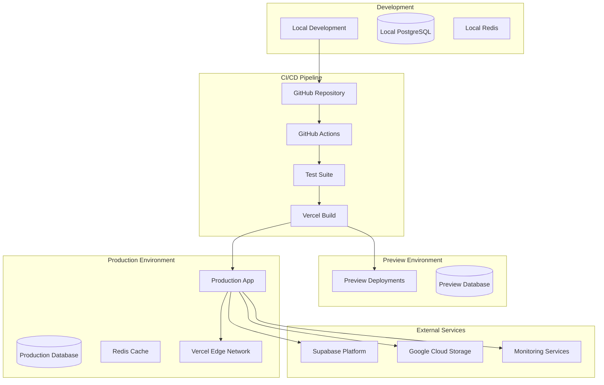
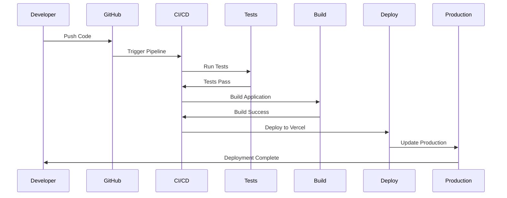

# Deployment Architecture

## Overview

The deployment architecture leverages modern cloud platforms and CI/CD practices to ensure reliable, scalable, and secure deployments. The system uses Vercel for application hosting, Supabase for backend services, and Google Cloud Platform for additional infrastructure needs.

## Infrastructure Overview



## Deployment Environments

### Environment Strategy

| Environment | Purpose | URL | Database | Branch |
|------------|---------|-----|----------|--------|
| Development | Local development | localhost:3000 | Local/Docker | feature/* |
| Preview | PR reviews | *.vercel.app | Preview DB | PR branches |
| Staging | Pre-production testing | staging.domain.com | Staging DB | staging |
| Production | Live application | domain.com | Production DB | main |

### Environment Configuration

```bash
# Development (.env.local)
NEXT_PUBLIC_SUPABASE_URL=http://localhost:54321
NEXT_PUBLIC_SUPABASE_ANON_KEY=dev-key
SUPABASE_SERVICE_ROLE_KEY=dev-service-key
NODE_ENV=development

# Staging (.env.staging)
NEXT_PUBLIC_SUPABASE_URL=https://staging.supabase.co
NEXT_PUBLIC_SUPABASE_ANON_KEY=staging-key
SUPABASE_SERVICE_ROLE_KEY=staging-service-key
NODE_ENV=staging

# Production (.env.production)
NEXT_PUBLIC_SUPABASE_URL=https://prod.supabase.co
NEXT_PUBLIC_SUPABASE_ANON_KEY=prod-key
SUPABASE_SERVICE_ROLE_KEY=prod-service-key
NODE_ENV=production
```

## CI/CD Pipeline

### GitHub Actions Workflow

```yaml
name: Deploy Pipeline

on:
  push:
    branches: [main, staging]
  pull_request:
    branches: [main]

jobs:
  test:
    runs-on: ubuntu-latest
    steps:
      - uses: actions/checkout@v3
      - uses: actions/setup-node@v3
        with:
          node-version: '22'
      - run: npm ci
      - run: npm run lint
      - run: npm run type-check
      - run: npm run test:unit
      - run: npm run test:integration

  security:
    runs-on: ubuntu-latest
    steps:
      - uses: actions/checkout@v3
      - name: Security Scan
        run: |
          npm audit
          npm run security:scan

  build:
    needs: [test, security]
    runs-on: ubuntu-latest
    steps:
      - uses: actions/checkout@v3
      - uses: actions/setup-node@v3
      - run: npm ci
      - run: npm run build
      - uses: actions/upload-artifact@v3
        with:
          name: build-artifacts
          path: .next/

  deploy:
    needs: build
    if: github.ref == 'refs/heads/main'
    runs-on: ubuntu-latest
    steps:
      - uses: actions/checkout@v3
      - uses: amondnet/vercel-action@v25
        with:
          vercel-token: ${{ secrets.VERCEL_TOKEN }}
          vercel-org-id: ${{ secrets.ORG_ID }}
          vercel-project-id: ${{ secrets.PROJECT_ID }}
          vercel-args: '--prod'
```

### Deployment Process



## Infrastructure as Code

### Terraform Configuration

```hcl
# main.tf
terraform {
  required_providers {
    vercel = {
      source  = "vercel/vercel"
      version = "~> 0.11"
    }
    supabase = {
      source  = "supabase/supabase"
      version = "~> 1.0"
    }
    google = {
      source  = "hashicorp/google"
      version = "~> 4.0"
    }
  }
}

# Vercel Project
resource "vercel_project" "initiative_dashboard" {
  name      = "initiative-dashboard"
  framework = "nextjs"
  
  git_repository = {
    type = "github"
    repo = "org/initiative-dashboard"
  }
  
  environment = [
    {
      key    = "NEXT_PUBLIC_SUPABASE_URL"
      value  = supabase_project.main.url
      target = ["production"]
    }
  ]
}

# Supabase Project
resource "supabase_project" "main" {
  name         = "initiative-dashboard"
  region       = "us-east-1"
  pricing_tier = "pro"
  
  database_password = var.db_password
}

# Google Cloud Storage
resource "google_storage_bucket" "uploads" {
  name          = "initiative-dashboard-uploads"
  location      = "US"
  force_destroy = false
  
  lifecycle_rule {
    condition {
      age = 90
    }
    action {
      type = "Delete"
    }
  }
  
  cors {
    origin          = ["https://domain.com"]
    method          = ["GET", "POST", "PUT", "DELETE"]
    response_header = ["*"]
    max_age_seconds = 3600
  }
}
```

## Container Architecture

### Docker Configuration

```dockerfile
# Dockerfile
FROM node:22-alpine AS deps
RUN apk add --no-cache libc6-compat
WORKDIR /app
COPY package*.json ./
RUN npm ci --only=production

FROM node:22-alpine AS builder
WORKDIR /app
COPY --from=deps /app/node_modules ./node_modules
COPY . .
RUN npm run build

FROM node:22-alpine AS runner
WORKDIR /app

ENV NODE_ENV production

RUN addgroup --system --gid 1001 nodejs
RUN adduser --system --uid 1001 nextjs

COPY --from=builder /app/public ./public
COPY --from=builder /app/.next/standalone ./
COPY --from=builder /app/.next/static ./.next/static

USER nextjs

EXPOSE 3000

ENV PORT 3000

CMD ["node", "server.js"]
```

### Docker Compose

```yaml
# docker-compose.yml
version: '3.8'

services:
  app:
    build: .
    ports:
      - "3000:3000"
    environment:
      - NODE_ENV=production
      - NEXT_PUBLIC_SUPABASE_URL=${NEXT_PUBLIC_SUPABASE_URL}
      - NEXT_PUBLIC_SUPABASE_ANON_KEY=${NEXT_PUBLIC_SUPABASE_ANON_KEY}
    depends_on:
      - redis
    networks:
      - app-network

  redis:
    image: redis:7-alpine
    ports:
      - "6379:6379"
    volumes:
      - redis-data:/data
    networks:
      - app-network

  postgres:
    image: postgres:15-alpine
    environment:
      POSTGRES_DB: initiative_dashboard
      POSTGRES_USER: postgres
      POSTGRES_PASSWORD: ${DB_PASSWORD}
    ports:
      - "5432:5432"
    volumes:
      - postgres-data:/var/lib/postgresql/data
    networks:
      - app-network

volumes:
  redis-data:
  postgres-data:

networks:
  app-network:
    driver: bridge
```

## Kubernetes Deployment

### Kubernetes Manifests

```yaml
# deployment.yaml
apiVersion: apps/v1
kind: Deployment
metadata:
  name: initiative-dashboard
  namespace: production
spec:
  replicas: 3
  selector:
    matchLabels:
      app: initiative-dashboard
  template:
    metadata:
      labels:
        app: initiative-dashboard
    spec:
      containers:
      - name: app
        image: gcr.io/project/initiative-dashboard:latest
        ports:
        - containerPort: 3000
        env:
        - name: NODE_ENV
          value: "production"
        - name: NEXT_PUBLIC_SUPABASE_URL
          valueFrom:
            secretKeyRef:
              name: app-secrets
              key: supabase-url
        resources:
          requests:
            memory: "256Mi"
            cpu: "100m"
          limits:
            memory: "512Mi"
            cpu: "500m"
        livenessProbe:
          httpGet:
            path: /api/health
            port: 3000
          initialDelaySeconds: 30
          periodSeconds: 10
        readinessProbe:
          httpGet:
            path: /api/health
            port: 3000
          initialDelaySeconds: 5
          periodSeconds: 5

---
apiVersion: v1
kind: Service
metadata:
  name: initiative-dashboard-service
  namespace: production
spec:
  selector:
    app: initiative-dashboard
  ports:
  - protocol: TCP
    port: 80
    targetPort: 3000
  type: LoadBalancer

---
apiVersion: autoscaling/v2
kind: HorizontalPodAutoscaler
metadata:
  name: initiative-dashboard-hpa
  namespace: production
spec:
  scaleTargetRef:
    apiVersion: apps/v1
    kind: Deployment
    name: initiative-dashboard
  minReplicas: 3
  maxReplicas: 10
  metrics:
  - type: Resource
    resource:
      name: cpu
      target:
        type: Utilization
        averageUtilization: 70
  - type: Resource
    resource:
      name: memory
      target:
        type: Utilization
        averageUtilization: 80
```

## Monitoring & Observability

### Monitoring Stack

```yaml
# monitoring-stack.yaml
services:
  prometheus:
    image: prom/prometheus
    volumes:
      - ./prometheus.yml:/etc/prometheus/prometheus.yml
    ports:
      - "9090:9090"

  grafana:
    image: grafana/grafana
    ports:
      - "3001:3000"
    environment:
      - GF_SECURITY_ADMIN_PASSWORD=${GRAFANA_PASSWORD}

  loki:
    image: grafana/loki
    ports:
      - "3100:3100"

  tempo:
    image: grafana/tempo
    ports:
      - "3200:3200"
```

### Application Metrics

```typescript
// metrics.ts
import { register, Counter, Histogram, Gauge } from 'prom-client'

// Request metrics
export const httpRequestDuration = new Histogram({
  name: 'http_request_duration_seconds',
  help: 'Duration of HTTP requests in seconds',
  labelNames: ['method', 'route', 'status'],
  buckets: [0.1, 0.5, 1, 2, 5]
})

export const httpRequestTotal = new Counter({
  name: 'http_requests_total',
  help: 'Total number of HTTP requests',
  labelNames: ['method', 'route', 'status']
})

// Business metrics
export const activeUsers = new Gauge({
  name: 'active_users_total',
  help: 'Number of active users',
  labelNames: ['tenant']
})

export const initiativesCreated = new Counter({
  name: 'initiatives_created_total',
  help: 'Total number of initiatives created',
  labelNames: ['tenant', 'area']
})
```

## Deployment Checklist

### Pre-Deployment

- [ ] Code review completed
- [ ] All tests passing
- [ ] Security scan passed
- [ ] Performance benchmarks met
- [ ] Documentation updated
- [ ] Database migrations tested
- [ ] Environment variables configured
- [ ] SSL certificates valid

### Deployment Steps

1. **Database Migration**
   ```bash
   supabase db push
   supabase db seed
   ```

2. **Build Verification**
   ```bash
   npm run build
   npm run test:production
   ```

3. **Deploy to Staging**
   ```bash
   vercel --env=staging
   ```

4. **Smoke Tests**
   ```bash
   npm run test:e2e:staging
   ```

5. **Deploy to Production**
   ```bash
   vercel --prod
   ```

6. **Post-Deployment Verification**
   ```bash
   npm run test:e2e:production
   npm run monitor:production
   ```

### Rollback Procedure

```bash
# Immediate rollback
vercel rollback

# Database rollback
supabase db reset --db-url $PRODUCTION_DB_URL

# Cache invalidation
redis-cli FLUSHALL

# DNS rollback (if needed)
cloudflare-cli dns update --zone $ZONE_ID
```

## Security Considerations

### Security Scanning

```bash
# Dependency scanning
npm audit --production
snyk test

# Container scanning
trivy image gcr.io/project/initiative-dashboard:latest

# SAST scanning
semgrep --config=auto .

# Secret scanning
gitleaks detect --source . --verbose
```

### SSL/TLS Configuration

```nginx
# nginx.conf
server {
    listen 443 ssl http2;
    server_name domain.com;
    
    ssl_certificate /etc/ssl/certs/cert.pem;
    ssl_certificate_key /etc/ssl/private/key.pem;
    ssl_protocols TLSv1.2 TLSv1.3;
    ssl_ciphers HIGH:!aNULL:!MD5;
    ssl_prefer_server_ciphers on;
    
    add_header Strict-Transport-Security "max-age=31536000" always;
    add_header X-Frame-Options "SAMEORIGIN" always;
    add_header X-Content-Type-Options "nosniff" always;
    add_header X-XSS-Protection "1; mode=block" always;
}
```

## Performance Optimization

### CDN Configuration

```javascript
// vercel.json
{
  "headers": [
    {
      "source": "/static/(.*)",
      "headers": [
        {
          "key": "Cache-Control",
          "value": "public, max-age=31536000, immutable"
        }
      ]
    },
    {
      "source": "/(.*)",
      "headers": [
        {
          "key": "X-Content-Type-Options",
          "value": "nosniff"
        },
        {
          "key": "X-Frame-Options",
          "value": "DENY"
        },
        {
          "key": "X-XSS-Protection",
          "value": "1; mode=block"
        }
      ]
    }
  ],
  "rewrites": [
    {
      "source": "/api/:path*",
      "destination": "/api/:path*"
    }
  ]
}
```

### Edge Functions

```typescript
// middleware.ts
import { NextResponse } from 'next/server'
import type { NextRequest } from 'next/server'

export function middleware(request: NextRequest) {
  // Add security headers
  const response = NextResponse.next()
  
  response.headers.set(
    'Content-Security-Policy',
    "default-src 'self'; script-src 'self' 'unsafe-inline'"
  )
  
  // Geographic routing
  const country = request.geo?.country || 'US'
  if (country === 'EU') {
    response.headers.set('X-Region', 'eu-west-1')
  }
  
  return response
}

export const config = {
  matcher: '/((?!api|_next/static|_next/image|favicon.ico).*)'
}
```

## Disaster Recovery

### Backup Strategy

```bash
#!/bin/bash
# backup.sh

# Database backup
pg_dump $DATABASE_URL > backup_$(date +%Y%m%d_%H%M%S).sql

# Application backup
tar -czf app_backup_$(date +%Y%m%d_%H%M%S).tar.gz \
  --exclude=node_modules \
  --exclude=.next \
  .

# Upload to cloud storage
gsutil cp backup_*.sql gs://backup-bucket/database/
gsutil cp app_backup_*.tar.gz gs://backup-bucket/application/

# Cleanup old backups (keep 30 days)
find ./backups -type f -mtime +30 -delete
```

### Recovery Plan

1. **Infrastructure Recovery**
   - Provision new infrastructure using Terraform
   - Restore database from latest backup
   - Deploy application from Git repository
   - Restore configuration and secrets

2. **Data Recovery**
   - Identify point of failure
   - Restore from appropriate backup
   - Replay transaction logs if available
   - Verify data integrity

3. **Service Recovery**
   - Update DNS records
   - Clear CDN cache
   - Notify users of restoration
   - Monitor for issues

## Cost Optimization

### Resource Optimization

```typescript
// Auto-scaling configuration
const scalingConfig = {
  minInstances: process.env.NODE_ENV === 'production' ? 2 : 1,
  maxInstances: process.env.NODE_ENV === 'production' ? 10 : 3,
  targetCPU: 70,
  targetMemory: 80,
  scaleDownDelay: 300, // 5 minutes
  scaleUpDelay: 60     // 1 minute
}
```

### Cost Monitoring

```sql
-- Database cost analysis
SELECT 
  date_trunc('day', created_at) as day,
  COUNT(*) as queries,
  SUM(total_exec_time) as total_time,
  AVG(mean_exec_time) as avg_time
FROM pg_stat_statements
GROUP BY day
ORDER BY day DESC;
```

## Conclusion

The deployment architecture provides a robust, scalable, and secure foundation for the Initiative Dashboard. Key features include:

- **Automated CI/CD** pipeline with comprehensive testing
- **Multi-environment** strategy for safe deployments
- **Container-based** architecture for consistency
- **Comprehensive monitoring** and observability
- **Disaster recovery** procedures
- **Cost optimization** strategies

The architecture supports zero-downtime deployments, automatic scaling, and rapid rollback capabilities while maintaining security and performance standards.