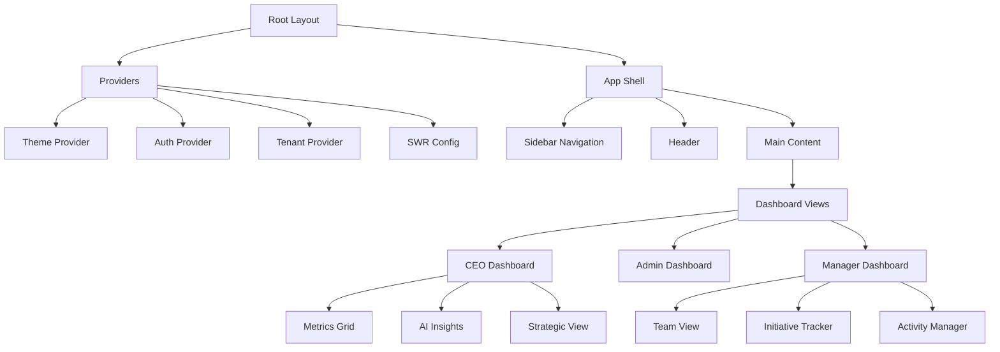

# Frontend Architecture

## Overview

The frontend architecture is built on Next.js 15 with React 19, leveraging the latest App Router paradigm for optimal performance and developer experience. The architecture emphasizes type safety, component reusability, and performance optimization.

## Technology Stack

### Core Technologies
- **Framework**: Next.js 15.0.3 (App Router)
- **UI Library**: React 19.0.0
- **Language**: TypeScript 5.7.2
- **Styling**: Tailwind CSS 3.4.17
- **Component Library**: Radix UI + shadcn/ui
- **State Management**: SWR 2.2.5
- **Forms**: React Hook Form 7.54.2 + Zod 3.24.1
- **Charts**: Recharts 2.15.0
- **Animations**: Framer Motion 11.15.0

## Application Structure

```
app/                          # Next.js App Router
├── (auth)/                  # Auth group routes
│   ├── login/
│   ├── register/
│   └── reset-password/
├── api/                     # API routes
├── dashboard/               # Main dashboard
├── ceo/                     # CEO-specific views
├── manager/                 # Manager views
├── org-admin/               # Organization admin
└── layout.tsx               # Root layout

components/                   # React components
├── ui/                      # Base UI components
├── dashboard/               # Dashboard components
├── forms/                   # Form components
├── charts/                  # Chart components
├── manager/                 # Manager components
├── ceo/                     # CEO components
└── stratix/                 # AI components

hooks/                        # Custom React hooks
├── use*.tsx                 # Individual hooks
└── ceo/                     # CEO-specific hooks

lib/                          # Utilities and services
├── types/                   # TypeScript types
├── utils/                   # Utility functions
├── validation/              # Validation schemas
└── adapters/                # Data adapters
```

## Component Architecture

### Component Hierarchy



### Component Design Principles

1. **Atomic Design**: Components follow atomic design methodology
   - Atoms: Basic UI elements (buttons, inputs)
   - Molecules: Simple component groups
   - Organisms: Complex components
   - Templates: Page layouts
   - Pages: Specific instances

2. **Composition over Inheritance**: Favor component composition
3. **Single Responsibility**: Each component has one clear purpose
4. **Props Interface**: Strongly typed props with TypeScript
5. **Accessibility First**: ARIA compliance and keyboard navigation

## State Management

### Data Fetching Strategy

```typescript
// SWR Configuration
const swrConfig = {
  refreshInterval: 30000,
  revalidateOnFocus: true,
  revalidateOnReconnect: true,
  dedupingInterval: 2000,
  errorRetryCount: 3,
  errorRetryInterval: 5000,
  shouldRetryOnError: true,
  keepPreviousData: true,
}
```

### State Layers

1. **Server State**: Managed by SWR
   - API data caching
   - Automatic revalidation
   - Optimistic updates
   - Error handling

2. **Client State**: React hooks and context
   - UI state (modals, forms)
   - User preferences
   - Temporary data

3. **URL State**: Query parameters
   - Filters and search
   - Pagination
   - Sort order

### Custom Hooks Architecture

```typescript
// Example: useInitiatives hook pattern
interface UseInitiativesOptions {
  areaId?: string
  status?: string
  page?: number
  limit?: number
}

interface UseInitiativesReturn {
  initiatives: Initiative[]
  loading: boolean
  error: Error | null
  mutate: () => void
  createInitiative: (data: CreateInitiativeDTO) => Promise<void>
  updateInitiative: (id: string, data: UpdateInitiativeDTO) => Promise<void>
  deleteInitiative: (id: string) => Promise<void>
}

export function useInitiatives(options?: UseInitiativesOptions): UseInitiativesReturn
```

## Routing Architecture

### Route Organization

```
app/
├── (public)/                # Public routes
├── (auth)/                  # Auth routes (no layout)
├── (protected)/             # Protected routes
│   ├── dashboard/
│   ├── ceo/
│   ├── manager/
│   └── org-admin/
└── api/                     # API routes
```

### Route Protection

```typescript
// Middleware-based protection
export async function middleware(request: NextRequest) {
  const session = await getSession(request)
  
  if (!session && isProtectedRoute(request.nextUrl.pathname)) {
    return NextResponse.redirect(new URL('/login', request.url))
  }
  
  return updateSession(request)
}
```

## Performance Optimization

### Code Splitting Strategy

1. **Route-based splitting**: Automatic with Next.js
2. **Component lazy loading**:
```typescript
const HeavyChart = dynamic(() => import('@/components/charts/HeavyChart'), {
  loading: () => <ChartSkeleton />,
  ssr: false
})
```

3. **Bundle optimization**:
```javascript
// next.config.mjs
experimental: {
  optimizePackageImports: [
    '@radix-ui/react-*',
    'lucide-react',
    'recharts',
    'date-fns'
  ]
}
```

### Image Optimization

```typescript
// Using Next.js Image component
import Image from 'next/image'

<Image
  src="/logo.png"
  alt="Logo"
  width={200}
  height={50}
  priority
  placeholder="blur"
  blurDataURL={shimmer}
/>
```

### Web Vitals Monitoring

```typescript
// Web Vitals tracking
export function reportWebVitals(metric: NextWebVitalsMetric) {
  if (metric.label === 'web-vital') {
    analytics.track('Web Vital', {
      name: metric.name,
      value: metric.value,
      id: metric.id
    })
  }
}
```

## Styling Architecture

### Tailwind CSS Configuration

```javascript
// tailwind.config.ts
theme: {
  extend: {
    colors: {
      border: 'hsl(var(--border))',
      background: 'hsl(var(--background))',
      foreground: 'hsl(var(--foreground))',
      primary: { /* ... */ },
      secondary: { /* ... */ },
      // Tenant-specific colors
      siga: { /* ... */ },
      fema: { /* ... */ },
      stratix: { /* ... */ }
    }
  }
}
```

### CSS Architecture

1. **Utility-first**: Tailwind CSS for rapid development
2. **Component styles**: CSS Modules for complex components
3. **Theme system**: CSS variables for theming
4. **Responsive design**: Mobile-first approach

### Theme Implementation

```typescript
// Theme provider pattern
interface Theme {
  colors: ColorScheme
  spacing: SpacingScale
  typography: Typography
  shadows: Shadows
  animations: Animations
}

const themes: Record<Tenant, Theme> = {
  siga: sigaTheme,
  fema: femaTheme,
  stratix: stratixTheme
}
```

## Form Architecture

### Form Stack

```typescript
// React Hook Form + Zod pattern
const schema = z.object({
  title: z.string().min(1, 'Title is required'),
  description: z.string().optional(),
  dueDate: z.date().min(new Date(), 'Date must be in future')
})

type FormData = z.infer<typeof schema>

const form = useForm<FormData>({
  resolver: zodResolver(schema),
  defaultValues: {
    title: '',
    description: '',
    dueDate: new Date()
  }
})
```

### Form Components

```typescript
// Reusable form field component
<FormField
  control={form.control}
  name="title"
  render={({ field }) => (
    <FormItem>
      <FormLabel>Title</FormLabel>
      <FormControl>
        <Input {...field} />
      </FormControl>
      <FormDescription>Enter initiative title</FormDescription>
      <FormMessage />
    </FormItem>
  )}
/>
```

## Error Handling

### Error Boundary Implementation

```typescript
// Global error boundary
export default function GlobalError({
  error,
  reset,
}: {
  error: Error & { digest?: string }
  reset: () => void
}) {
  useEffect(() => {
    console.error(error)
    reportError(error)
  }, [error])

  return (
    <html>
      <body>
        <ErrorPage error={error} reset={reset} />
      </body>
    </html>
  )
}
```

### Error Recovery Strategies

1. **Retry mechanisms**: Automatic retry with exponential backoff
2. **Fallback UI**: Graceful degradation
3. **Error reporting**: Centralized error logging
4. **User feedback**: Clear error messages

## Internationalization (i18n)

### i18n Architecture

```typescript
// Locale configuration
const locales = ['en', 'es'] as const
type Locale = typeof locales[number]

// Translation loading
async function getMessages(locale: Locale) {
  return (await import(`@/locales/${locale}/common.json`)).default
}

// Usage in components
const t = useTranslations('dashboard')
<h1>{t('title')}</h1>
```

### Translation Structure

```
locales/
├── en/
│   ├── common.json
│   ├── dashboard.json
│   └── forms.json
└── es/
    ├── common.json
    ├── dashboard.json
    └── forms.json
```

## Testing Strategy

### Testing Pyramid

```
         /\
        /  \       E2E Tests (Playwright)
       /    \      - Critical user journeys
      /      \     - Cross-browser testing
     /--------\    
    /          \   Integration Tests (Vitest)
   /            \  - API integration
  /              \ - Component integration
 /________________\
Unit Tests (Vitest) - Component logic
                    - Custom hooks
                    - Utility functions
```

### Testing Patterns

```typescript
// Component testing pattern
describe('InitiativeCard', () => {
  it('should render initiative data', () => {
    const { getByText } = render(
      <InitiativeCard initiative={mockInitiative} />
    )
    expect(getByText(mockInitiative.title)).toBeInTheDocument()
  })
  
  it('should handle click events', async () => {
    const handleClick = vi.fn()
    const { getByRole } = render(
      <InitiativeCard 
        initiative={mockInitiative}
        onClick={handleClick}
      />
    )
    await userEvent.click(getByRole('button'))
    expect(handleClick).toHaveBeenCalledWith(mockInitiative.id)
  })
})
```

## Build & Deployment

### Build Process

```bash
# Build optimization
next build
# Output:
# - .next/              # Build output
# - .next/static/       # Static assets
# - .next/server/       # Server bundles
```

### Bundle Analysis

```bash
# Analyze bundle size
npm run analyze

# Performance monitoring
npm run perf:monitor
```

## Security Considerations

### Frontend Security Measures

1. **Content Security Policy (CSP)**
```typescript
headers: [
  {
    key: 'Content-Security-Policy',
    value: "default-src 'self'; script-src 'self' 'unsafe-inline'"
  }
]
```

2. **Input Sanitization**: All user inputs sanitized
3. **XSS Prevention**: React's built-in protection
4. **HTTPS Enforcement**: Secure connections only
5. **Secure Storage**: Sensitive data in httpOnly cookies

## Performance Metrics

### Target Metrics

| Metric | Target | Current |
|--------|--------|---------|
| FCP (First Contentful Paint) | < 1.8s | 1.2s |
| LCP (Largest Contentful Paint) | < 2.5s | 1.8s |
| FID (First Input Delay) | < 100ms | 50ms |
| CLS (Cumulative Layout Shift) | < 0.1 | 0.05 |
| TTI (Time to Interactive) | < 3.8s | 2.5s |

## Mobile Optimization

### Progressive Web App (PWA)

```json
// manifest.json
{
  "name": "Initiative Dashboard",
  "short_name": "InitDash",
  "display": "standalone",
  "orientation": "portrait",
  "theme_color": "#6366f1",
  "background_color": "#ffffff"
}
```

### Mobile-First Design

1. **Responsive breakpoints**:
   - Mobile: 0-640px
   - Tablet: 641-1024px
   - Desktop: 1025px+

2. **Touch optimizations**:
   - Minimum touch target: 44x44px
   - Gesture support
   - Virtual keyboard handling

## Conclusion

The frontend architecture is designed for scalability, performance, and developer experience. It leverages modern React patterns, Next.js capabilities, and TypeScript for a robust, maintainable codebase. The architecture supports multi-tenancy, real-time updates, and AI integration while maintaining excellent performance and user experience across all devices.