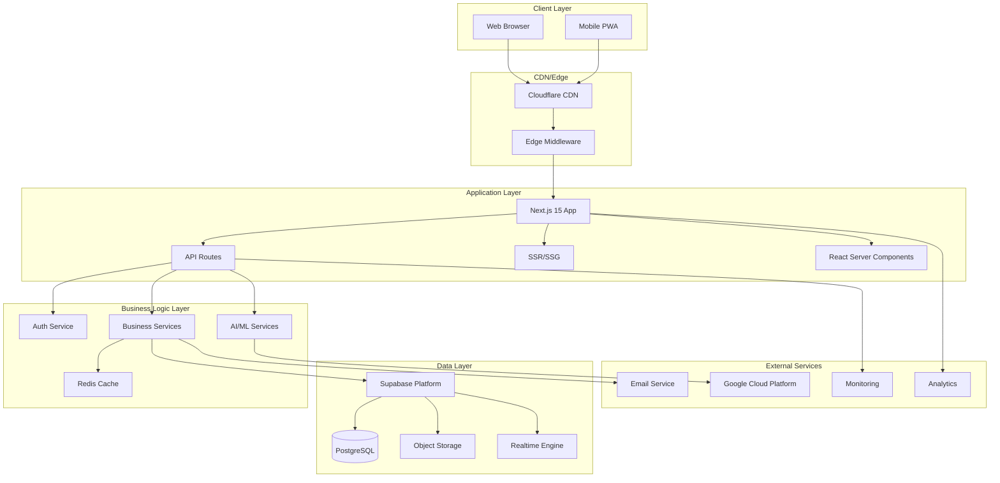
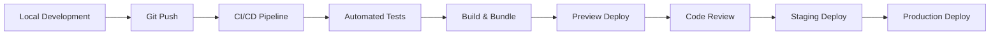
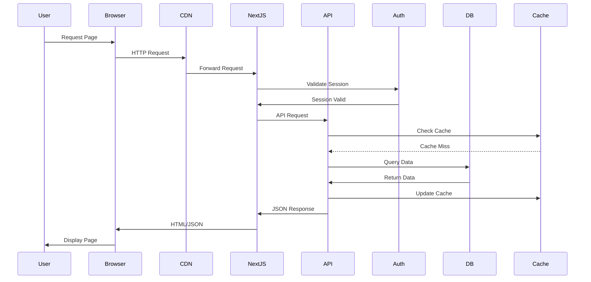

# System Architecture Overview

## Executive Summary

The Initiative Dashboard is a multi-tenant, enterprise-grade OKR (Objectives and Key Results) management platform built on modern cloud-native architecture. The system provides strategic planning, execution tracking, and performance analytics capabilities across multiple organizations with complete data isolation and role-based access control.

## Architecture Principles

### Core Design Principles
1. **Multi-Tenancy First**: Complete data isolation at database level using Row Level Security (RLS)
2. **Security by Default**: Authentication and authorization at every layer
3. **Scalability**: Horizontal scaling capabilities with stateless architecture
4. **Performance**: Optimized queries, caching strategies, and lazy loading
5. **Developer Experience**: Type-safe development with TypeScript throughout
6. **Observability**: Comprehensive logging, monitoring, and audit trails

## High-Level Architecture

## Technology Stack

### Frontend
- **Framework**: Next.js 15 (App Router)
- **UI Library**: React 19
- **Language**: TypeScript 5.x
- **Styling**: Tailwind CSS 3.x
- **Components**: Radix UI / shadcn/ui
- **State Management**: SWR for data fetching
- **Charts**: Recharts
- **Forms**: React Hook Form + Zod validation

### Backend
- **Runtime**: Node.js 22.x
- **API**: Next.js API Routes
- **Database**: PostgreSQL 15+ (via Supabase)
- **Authentication**: Supabase Auth (JWT)
- **Caching**: Redis (optional)
- **File Storage**: Google Cloud Storage / Supabase Storage

### Infrastructure
- **Platform**: Vercel (Primary)
- **Database Platform**: Supabase
- **CDN**: Vercel Edge Network
- **AI/ML**: Google Gemini API
- **Email**: Brevo (SendinBlue)
- **Monitoring**: Vercel Analytics

## System Components

### 1. Authentication & Authorization
- JWT-based authentication via Supabase Auth
- Role-based access control (CEO, Admin, Manager)
- Multi-factor authentication support
- SSO capabilities for enterprise

### 2. Multi-Tenant Architecture
- Tenant isolation via Row Level Security
- Subdomain-based tenant detection
- Organization hierarchy support
- Cross-tenant data protection

### 3. Data Management
- PostgreSQL with RLS policies
- Automated audit logging
- Data migration framework
- Backup and recovery strategies

### 4. API Architecture
- RESTful API design
- Consistent error handling
- Rate limiting and throttling
- Request validation and sanitization

### 5. Real-time Features
- WebSocket connections via Supabase Realtime
- Live collaboration features
- Push notifications
- Activity feeds

### 6. AI Integration
- Google Gemini for intelligent insights
- Natural language processing
- Predictive analytics
- Smart recommendations

## Security Architecture

### Defense in Depth
1. **Network Security**
   - HTTPS everywhere
   - CSP headers
   - CORS configuration
   - Rate limiting

2. **Application Security**
   - Input validation
   - SQL injection prevention
   - XSS protection
   - CSRF tokens

3. **Data Security**
   - Encryption at rest
   - Encryption in transit
   - RLS policies
   - Audit logging

4. **Access Control**
   - JWT validation
   - Role-based permissions
   - API key management
   - Session management

## Performance Architecture

### Optimization Strategies
1. **Frontend Performance**
   - Code splitting
   - Lazy loading
   - Image optimization
   - Bundle optimization
   - Service workers

2. **Backend Performance**
   - Query optimization
   - Database indexing
   - Connection pooling
   - Caching strategies

3. **Caching Layers**
   - Browser cache
   - CDN cache
   - Application cache (SWR)
   - Database query cache
   - Redis cache (optional)

## Scalability Design

### Horizontal Scaling
- Stateless application servers
- Database read replicas
- Load balancing
- Auto-scaling policies

### Vertical Scaling
- Database performance tiers
- Compute optimization
- Memory management
- Connection limits

## Monitoring & Observability

### Monitoring Stack
1. **Application Monitoring**
   - Error tracking
   - Performance metrics
   - User analytics
   - Custom events

2. **Infrastructure Monitoring**
   - Server metrics
   - Database performance
   - API latency
   - Resource utilization

3. **Business Monitoring**
   - User engagement
   - Feature adoption
   - Conversion metrics
   - Revenue tracking

## Disaster Recovery

### Backup Strategy
- Automated daily backups
- Point-in-time recovery
- Geographic redundancy
- Regular restore testing

### Recovery Procedures
1. **RTO (Recovery Time Objective)**: < 4 hours
2. **RPO (Recovery Point Objective)**: < 1 hour
3. **Failover procedures**
4. **Data restoration workflows**

## Development Workflow

### CI/CD Pipeline

### Environment Strategy
- **Development**: Local development environment
- **Preview**: Vercel preview deployments
- **Staging**: Pre-production environment
- **Production**: Live production environment

## API Architecture Patterns

### Design Patterns Used
1. **Repository Pattern**: Data access abstraction
2. **Adapter Pattern**: External service integration
3. **Middleware Pattern**: Request processing pipeline
4. **Observer Pattern**: Real-time subscriptions
5. **Factory Pattern**: Object creation
6. **Singleton Pattern**: Service instances

### API Versioning Strategy
- Version-less API with backward compatibility
- Feature flags for gradual rollouts
- Deprecation notices
- Migration guides

## Data Flow Architecture

## Key Architecture Decisions

### ADR-001: Next.js App Router
**Decision**: Use Next.js 15 with App Router
**Rationale**: Better performance, React Server Components, improved DX
**Consequences**: Modern architecture, better SEO, learning curve

### ADR-002: Supabase Platform
**Decision**: Use Supabase for backend services
**Rationale**: Integrated auth, database, storage, realtime
**Consequences**: Vendor lock-in, simplified operations

### ADR-003: Multi-Tenant via RLS
**Decision**: Implement multi-tenancy using Row Level Security
**Rationale**: Database-level isolation, security, simplicity
**Consequences**: Complex policies, testing requirements

### ADR-004: TypeScript Everywhere
**Decision**: Use TypeScript for all code
**Rationale**: Type safety, better DX, fewer bugs
**Consequences**: Build complexity, learning curve

## Future Architecture Roadmap

### Phase 1 (Current)
- ✅ Multi-tenant platform
- ✅ Role-based access
- ✅ Basic AI integration
- ✅ Real-time updates

### Phase 2 (Q2 2025)
- 🔄 Enhanced AI capabilities
- 🔄 Mobile native apps
- 🔄 Advanced analytics
- 🔄 Workflow automation

### Phase 3 (Q3 2025)
- 📋 Microservices migration
- 📋 Multi-region deployment
- 📋 Enterprise SSO
- 📋 API marketplace

### Phase 4 (Q4 2025)
- 📋 ML-powered predictions
- 📋 Blockchain integration
- 📋 IoT connectivity
- 📋 Voice interfaces

## Conclusion

The Initiative Dashboard architecture represents a modern, scalable, and secure approach to building enterprise SaaS applications. The combination of Next.js, Supabase, and cloud-native services provides a robust foundation for current needs while maintaining flexibility for future growth.

The architecture prioritizes:
- **Security**: Multi-layered security approach
- **Performance**: Optimized at every level
- **Scalability**: Ready for growth
- **Maintainability**: Clean code and clear patterns
- **Developer Experience**: Modern tooling and practices

This architecture is designed to evolve with changing requirements while maintaining stability and performance for existing users.