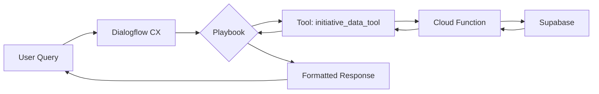

# Dialogflow CX Implementation Status

## 🎯 Current Status
The Dialogflow CX agent is configured but the tool integration is not working. This document outlines the complete implementation to make it functional.

## 📋 Implementation Checklist

### ✅ Completed
- [x] Dialogflow CX Agent created (ID: 7f297240-ca50-4896-8b71-e82fd707fa88)
- [x] Cloud Function webhook created (dialogflowWebhook)
- [x] Basic playbook configured
- [x] Widget components created

### 🚧 In Progress
- [x] Created getInitiativeData Cloud Function for tool integration
- [x] Created deployment scripts
- [x] Created OpenAPI schema for tool
- [x] Created updated playbook with tool instructions
- [ ] Deploy Cloud Function to GCP
- [ ] Configure tool in Dialogflow CX Console
- [ ] Update playbook to use tool
- [ ] Test integration

## 📦 Files Created

### Cloud Function
```
cloud-functions/getInitiativeData/
├── index.js           # Main function code
├── package.json       # Dependencies
├── deploy.sh          # Deployment script
└── test-local.js      # Local test script
```

### Configuration Scripts
```
scripts/
└── configure-dialogflow-tool.sh  # Tool configuration helper
```

### Documentation
```
docs/
├── DIALOGFLOW_TOOL_SETUP.md           # Complete setup guide
├── dialog-search/playbook-with-tool.yaml  # Updated playbook
└── DIALOGFLOW_IMPLEMENTATION_STATUS.md    # This file
```

## 🚀 Next Steps to Complete Implementation

### Step 1: Deploy Cloud Function
```bash
# Load environment variables
source .env.local
export SUPABASE_SERVICE_ROLE_KEY="your-key-here"

# Deploy function
cd cloud-functions/getInitiativeData
./deploy.sh
```

### Step 2: Configure Tool in Dialogflow CX
1. Go to [Dialogflow CX Console](https://dialogflow.cloud.google.com/cx/projects/insaight-backend/locations/us-central1/agents/7f297240-ca50-4896-8b71-e82fd707fa88)
2. Navigate to **Manage → Tools**
3. Click **+ Create Tool**
4. Name: `initiative_data_tool`
5. Type: **OpenAPI**
6. Paste the OpenAPI schema from `/tmp/openapi-schema.yaml`
7. Save

### Step 3: Update Playbook
1. Go to **Playbooks** in Dialogflow CX
2. Edit your existing playbook
3. Replace content with `/docs/dialog-search/playbook-with-tool.yaml`
4. Save and activate

### Step 4: Test
1. Use Test Agent in Dialogflow CX
2. Try: "Show me all initiatives"
3. Verify tool is called and data is returned

## 🔧 Troubleshooting Guide

### Issue: Tool not being called
**Solution:** Make playbook instructions more explicit about using ${TOOL:initiative_data_tool}

### Issue: Cloud Function errors
**Check:**
```bash
gcloud functions logs read getInitiativeData --limit 50
```

### Issue: No data returned
**Verify:**
- Supabase service key is correct
- Tenant ID matches your data
- Tables have data

## 📊 How It Works



## 🔐 Security Considerations

1. **Cloud Function**: Currently set to `--allow-unauthenticated` for testing
   - **Production**: Use service account authentication

2. **Supabase Key**: Stored as environment variable
   - **Never** commit to repository
   - Use Secret Manager in production

3. **Data Access**: Function uses service role key
   - Has full access to all tenant data
   - Consider implementing tenant filtering

## 📝 Configuration Details

### Agent Details
- **Project**: insaight-backend
- **Location**: us-central1
- **Agent ID**: 7f297240-ca50-4896-8b71-e82fd707fa88
- **Agent URL**: https://dialogflow.cloud.google.com/cx/projects/insaight-backend/locations/us-central1/agents/7f297240-ca50-4896-8b71-e82fd707fa88

### Cloud Function URL
```
https://us-central1-insaight-backend.cloudfunctions.net/getInitiativeData
```

### Tool Configuration
- **Name**: initiative_data_tool
- **Type**: OpenAPI
- **Authentication**: None (public function)
- **Operations**: getInitiativeData (POST)

## 🧪 Testing Commands

### Test Cloud Function Directly
```bash
curl -X POST https://us-central1-insaight-backend.cloudfunctions.net/getInitiativeData \
  -H 'Content-Type: application/json' \
  -d '{
    "query": "show initiatives",
    "filters": {
      "status": "in_progress"
    }
  }'
```

### Test Locally
```bash
cd cloud-functions/getInitiativeData
node test-local.js
```

## 📈 Monitoring

### View Logs
```bash
# Cloud Function logs
gcloud functions logs read getInitiativeData --limit 50

# Dialogflow logs
gcloud logging read "resource.labels.agent_id=\"7f297240-ca50-4896-8b71-e82fd707fa88\"" --limit 50
```

### Metrics
- Function invocations
- Response times
- Error rates
- Tool usage in Dialogflow

## 🎯 Success Criteria

The implementation is successful when:
1. ✅ User asks "Show me initiatives"
2. ✅ Dialogflow calls the tool
3. ✅ Tool calls Cloud Function
4. ✅ Function queries Supabase
5. ✅ Real data is returned
6. ✅ User sees formatted response with actual initiatives

## 📞 Support

For issues:
1. Check this document first
2. Review `/docs/DIALOGFLOW_TOOL_SETUP.md`
3. Check Cloud Function logs
4. Verify Dialogflow diagnostics

## 🔄 Version History

- **v1.0** (2025-08-12): Initial implementation with tool integration
- Previous: Basic webhook without tools (not working properly)