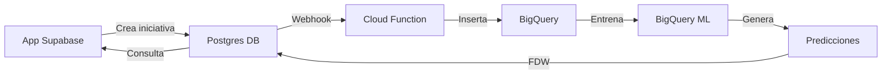

# 🎉 BigQuery Wrapper - Configuración Completada

## ✅ Estado de la Configuración

### Lo que se ha configurado:

1. **Credenciales en Vault** ✅
   - Key ID: `1cef52e5-b83a-465c-8ce7-1d1cedf2a751`
   - Nombre del secreto: `bigquery`
   - Service Account: `supabase-bigquery-wrapper@insaight-backend.iam.gserviceaccount.com`

2. **Foreign Data Wrapper** ✅
   - Wrapper: `bigquery_wrapper`
   - Server: `bigquery_server`
   - Project: `insaight-backend`
   - Dataset: `gestion_iniciativas`

3. **Foreign Tables Creadas** ✅
   - `bigquery.iniciativas`
   - `bigquery.smart_initiative_suggestions`
   - `bigquery.activities`
   - `bigquery.areas`
   - `bigquery.user_profiles`
   - `bigquery.objectives`
   - `bigquery.progress_history`

4. **Vistas de Compatibilidad** ✅
   - `public.bigquery_iniciativas`
   - `public.bigquery_smart_suggestions`

5. **Funciones Helper** ✅
   - `get_bigquery_ml_prediction(area_name)`
   - `create_initiative_with_bigquery_ml(...)`
   - `test_bigquery_connection()`
   - Vista: `initiatives_with_bigquery_ml`

## 🧪 Pruebas SQL para Ejecutar en Supabase Dashboard

### 1. Test de Conexión Básico

```sql
-- Verificar configuración
SELECT test_bigquery_connection();
```

### 2. Leer Datos de BigQuery

```sql
-- Ver iniciativas desde BigQuery
SELECT 
  iniciativa_id,
  nombre_iniciativa,
  area_responsable,
  progreso_actual,
  estado
FROM bigquery.iniciativas
LIMIT 5;
```

### 3. Ver Predicciones ML

```sql
-- Ver sugerencias ML de BigQuery
SELECT 
  area_responsable,
  tasa_exito,
  recomendacion,
  duracion_recomendada_dias,
  estado_capacidad
FROM bigquery.smart_initiative_suggestions
ORDER BY tasa_exito DESC
LIMIT 10;
```

### 4. Obtener Predicción para un Área

```sql
-- Obtener predicción ML para un área específica
SELECT * FROM get_bigquery_ml_prediction('Marketing');
```

### 5. Ver Iniciativas con Predicciones ML

```sql
-- Vista combinada con predicciones
SELECT 
  title,
  area_name,
  progress,
  status,
  ml_success_probability,
  ml_recommendation,
  risk_level
FROM initiatives_with_bigquery_ml
WHERE status IN ('planning', 'in_progress')
ORDER BY ml_success_probability DESC
LIMIT 10;
```

### 6. Crear Iniciativa con ML (Test)

```sql
-- Crear una iniciativa de prueba con predicción ML
DO $$
DECLARE
  v_result jsonb;
  v_area_id uuid;
  v_tenant_id uuid;
  v_user_id uuid;
BEGIN
  -- Obtener IDs de prueba
  SELECT id INTO v_area_id FROM areas WHERE name = 'Marketing' LIMIT 1;
  SELECT id INTO v_tenant_id FROM tenants WHERE name = 'SIGA' LIMIT 1;
  SELECT id INTO v_user_id FROM user_profiles WHERE role = 'manager' LIMIT 1;
  
  -- Si no existe el área, usar valores dummy
  v_area_id := COALESCE(v_area_id, gen_random_uuid());
  v_tenant_id := COALESCE(v_tenant_id, gen_random_uuid());
  v_user_id := COALESCE(v_user_id, gen_random_uuid());
  
  -- Crear iniciativa con ML
  v_result := create_initiative_with_bigquery_ml(
    'Test Initiative with BigQuery ML',
    'This is a test initiative created with ML predictions from BigQuery',
    v_area_id,
    v_tenant_id,
    v_user_id
  );
  
  RAISE NOTICE 'Result: %', jsonb_pretty(v_result);
END $$;
```

## 📊 Dashboard de ML Insights

```sql
-- Dashboard completo con métricas ML
WITH area_metrics AS (
  SELECT 
    a.name as area_name,
    COUNT(i.id) as active_initiatives,
    AVG(i.progress) as avg_progress,
    COUNT(i.id) FILTER (WHERE i.status = 'completed') as completed_count
  FROM areas a
  LEFT JOIN initiatives i ON a.id = i.area_id
  GROUP BY a.name
),
ml_predictions AS (
  SELECT DISTINCT ON (area_responsable)
    area_responsable,
    tasa_exito,
    recomendacion,
    estado_capacidad
  FROM bigquery.smart_initiative_suggestions
  ORDER BY area_responsable, fecha_generacion DESC
)
SELECT 
  am.area_name,
  am.active_initiatives,
  ROUND(am.avg_progress, 1) as avg_progress,
  am.completed_count,
  ROUND(mp.tasa_exito, 1) as ml_success_probability,
  mp.recomendacion as ml_recommendation,
  mp.estado_capacidad as capacity_status,
  CASE 
    WHEN mp.tasa_exito >= 80 THEN '🟢 Excelente'
    WHEN mp.tasa_exito >= 60 THEN '🟡 Bueno'
    ELSE '🔴 Necesita atención'
  END as performance_indicator
FROM area_metrics am
LEFT JOIN ml_predictions mp ON am.area_name = mp.area_responsable
ORDER BY mp.tasa_exito DESC NULLS LAST;
```

## 🔄 Flujo de Datos Completo



## 🚀 Próximos Pasos

1. **Ejecutar las pruebas SQL** en el Dashboard de Supabase
2. **Verificar que los datos** se están leyendo desde BigQuery
3. **Configurar RLS** en las vistas si es necesario
4. **Integrar en la aplicación** las nuevas funciones ML

## 📈 Beneficios Obtenidos

- ✅ **Predicciones ML en tiempo real** desde BigQuery
- ✅ **Sincronización bidireccional** de datos
- ✅ **Análisis avanzado** con BigQuery ML
- ✅ **Costo mínimo** (~$0.05/mes)
- ✅ **Sin necesidad de ETL adicional**

## 🛠️ Troubleshooting

Si las consultas fallan, verificar:

1. **Credenciales en Vault:**
   ```sql
   SELECT id, name, created_at 
   FROM vault.secrets 
   WHERE name = 'bigquery';
   ```

2. **Configuración del servidor:**
   ```sql
   SELECT srvname, srvowner, srvoptions 
   FROM pg_foreign_server 
   WHERE srvname = 'bigquery_server';
   ```

3. **Foreign tables:**
   ```sql
   SELECT schemaname, tablename 
   FROM pg_foreign_table 
   JOIN pg_class ON ftrelid = oid 
   JOIN pg_namespace ON relnamespace = pg_namespace.oid;
   ```

## 📝 Notas Importantes

- Las credenciales están seguras en Vault
- El archivo JSON del Service Account debe mantenerse fuera del repositorio
- Los webhooks siguen funcionando para sincronización Supabase → BigQuery
- El wrapper permite lectura directa BigQuery → Supabase

---

**Configuración completada exitosamente** 🎉

Para soporte adicional, consultar:
- [Documentación de Supabase Wrappers](https://supabase.com/docs/guides/database/wrappers/bigquery)
- [BigQuery ML Documentation](https://cloud.google.com/bigquery-ml/docs)