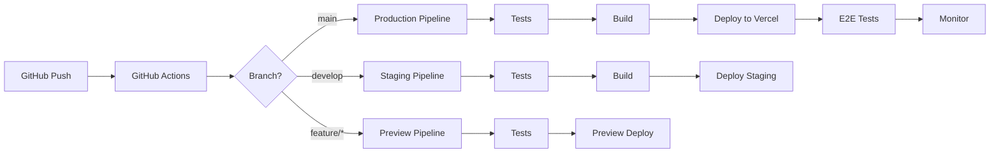

# CI/CD Pipeline Configuration

## Overview

This document describes the Continuous Integration and Continuous Deployment pipeline for the Initiative Dashboard, utilizing GitHub Actions for automation and Vercel for deployment.

## Pipeline Architecture



## GitHub Actions Workflows

### Main CI/CD Workflow

Create `.github/workflows/main.yml`:

```yaml
name: CI/CD Pipeline

on:
  push:
    branches: [main, develop]
  pull_request:
    branches: [main]

env:
  NODE_VERSION: '22'
  PNPM_VERSION: '10.13.1'

jobs:
  # Code Quality Checks
  quality:
    name: Code Quality
    runs-on: ubuntu-latest
    steps:
      - uses: actions/checkout@v4
      
      - name: Setup pnpm
        uses: pnpm/action-setup@v4
        with:
          version: ${{ env.PNPM_VERSION }}
      
      - name: Setup Node.js
        uses: actions/setup-node@v4
        with:
          node-version: ${{ env.NODE_VERSION }}
          cache: 'pnpm'
      
      - name: Install dependencies
        run: pnpm install --frozen-lockfile
      
      - name: Run linter
        run: pnpm lint
      
      - name: Type check
        run: pnpm tsc --noEmit
      
      - name: Check formatting
        run: pnpm prettier --check .

  # Unit and Integration Tests
  test:
    name: Test Suite
    runs-on: ubuntu-latest
    needs: quality
    strategy:
      matrix:
        test-type: [unit, integration]
    
    steps:
      - uses: actions/checkout@v4
      
      - name: Setup pnpm
        uses: pnpm/action-setup@v4
        with:
          version: ${{ env.PNPM_VERSION }}
      
      - name: Setup Node.js
        uses: actions/setup-node@v4
        with:
          node-version: ${{ env.NODE_VERSION }}
          cache: 'pnpm'
      
      - name: Install dependencies
        run: pnpm install --frozen-lockfile
      
      - name: Run ${{ matrix.test-type }} tests
        run: pnpm test:${{ matrix.test-type }}
        env:
          NEXT_PUBLIC_SUPABASE_URL: ${{ secrets.SUPABASE_URL }}
          NEXT_PUBLIC_SUPABASE_ANON_KEY: ${{ secrets.SUPABASE_ANON_KEY }}
      
      - name: Upload coverage
        if: matrix.test-type == 'unit'
        uses: codecov/codecov-action@v4
        with:
          token: ${{ secrets.CODECOV_TOKEN }}
          file: ./coverage/coverage-final.json

  # Build and Bundle Analysis
  build:
    name: Build Application
    runs-on: ubuntu-latest
    needs: test
    steps:
      - uses: actions/checkout@v4
      
      - name: Setup pnpm
        uses: pnpm/action-setup@v4
        with:
          version: ${{ env.PNPM_VERSION }}
      
      - name: Setup Node.js
        uses: actions/setup-node@v4
        with:
          node-version: ${{ env.NODE_VERSION }}
          cache: 'pnpm'
      
      - name: Install dependencies
        run: pnpm install --frozen-lockfile
      
      - name: Build application
        run: pnpm build
        env:
          NEXT_PUBLIC_SUPABASE_URL: ${{ secrets.SUPABASE_URL }}
          NEXT_PUBLIC_SUPABASE_ANON_KEY: ${{ secrets.SUPABASE_ANON_KEY }}
      
      - name: Analyze bundle size
        run: |
          npx bundle-buddy .next/static/**/*.js
          npx size-limit
      
      - name: Upload build artifacts
        uses: actions/upload-artifact@v4
        with:
          name: build-artifacts
          path: .next
          retention-days: 7

  # E2E Tests
  e2e:
    name: E2E Tests
    runs-on: ubuntu-latest
    needs: build
    strategy:
      matrix:
        tenant: [siga, fema, stratix]
    
    steps:
      - uses: actions/checkout@v4
      
      - name: Setup pnpm
        uses: pnpm/action-setup@v4
        with:
          version: ${{ env.PNPM_VERSION }}
      
      - name: Setup Node.js
        uses: actions/setup-node@v4
        with:
          node-version: ${{ env.NODE_VERSION }}
          cache: 'pnpm'
      
      - name: Install dependencies
        run: pnpm install --frozen-lockfile
      
      - name: Install Playwright
        run: pnpm exec playwright install --with-deps
      
      - name: Download build artifacts
        uses: actions/download-artifact@v4
        with:
          name: build-artifacts
          path: .next
      
      - name: Run E2E tests for ${{ matrix.tenant }}
        run: pnpm test:e2e:${{ matrix.tenant }}
        env:
          NEXT_PUBLIC_SUPABASE_URL: ${{ secrets.SUPABASE_URL }}
          NEXT_PUBLIC_SUPABASE_ANON_KEY: ${{ secrets.SUPABASE_ANON_KEY }}
          PLAYWRIGHT_TEST_BASE_URL: http://localhost:3000
      
      - name: Upload test results
        if: always()
        uses: actions/upload-artifact@v4
        with:
          name: e2e-results-${{ matrix.tenant }}
          path: automation/reports/
          retention-days: 30

  # Deploy to Vercel
  deploy:
    name: Deploy to Vercel
    runs-on: ubuntu-latest
    needs: [build, e2e]
    if: github.ref == 'refs/heads/main' || github.ref == 'refs/heads/develop'
    
    steps:
      - uses: actions/checkout@v4
      
      - name: Deploy to Vercel
        uses: amondnet/vercel-action@v25
        with:
          vercel-token: ${{ secrets.VERCEL_TOKEN }}
          vercel-org-id: ${{ secrets.VERCEL_ORG_ID }}
          vercel-project-id: ${{ secrets.VERCEL_PROJECT_ID }}
          vercel-args: ${{ github.ref == 'refs/heads/main' && '--prod' || '' }}
          scope: ${{ secrets.VERCEL_ORG_ID }}
      
      - name: Get deployment URL
        id: deployment
        run: |
          if [ "${{ github.ref }}" == "refs/heads/main" ]; then
            echo "url=https://siga-turismo.vercel.app" >> $GITHUB_OUTPUT
          else
            echo "url=https://staging-siga-turismo.vercel.app" >> $GITHUB_OUTPUT
          fi
      
      - name: Comment PR
        if: github.event_name == 'pull_request'
        uses: actions/github-script@v7
        with:
          script: |
            github.rest.issues.createComment({
              issue_number: context.issue.number,
              owner: context.repo.owner,
              repo: context.repo.repo,
              body: '✅ Deployed to ${{ steps.deployment.outputs.url }}'
            })

  # Post-deployment validation
  validate:
    name: Validate Deployment
    runs-on: ubuntu-latest
    needs: deploy
    if: github.ref == 'refs/heads/main'
    
    steps:
      - uses: actions/checkout@v4
      
      - name: Wait for deployment
        run: sleep 60
      
      - name: Health check
        run: |
          response=$(curl -s -o /dev/null -w "%{http_code}" https://siga-turismo.vercel.app/api/health)
          if [ $response -ne 200 ]; then
            echo "Health check failed with status $response"
            exit 1
          fi
      
      - name: Run smoke tests
        run: |
          npx playwright test --config=automation/config/playwright.config.ts --grep @smoke
        env:
          PLAYWRIGHT_TEST_BASE_URL: https://siga-turismo.vercel.app
```

### Pull Request Workflow

Create `.github/workflows/pr.yml`:

```yaml
name: Pull Request Checks

on:
  pull_request:
    types: [opened, synchronize, reopened]

jobs:
  # Check PR title and description
  pr-lint:
    name: PR Lint
    runs-on: ubuntu-latest
    steps:
      - uses: amannn/action-semantic-pull-request@v5
        env:
          GITHUB_TOKEN: ${{ secrets.GITHUB_TOKEN }}
        with:
          types: |
            feat
            fix
            docs
            style
            refactor
            perf
            test
            build
            ci
            chore
            revert
          requireScope: false
          subjectPattern: ^(?![A-Z]).+$
          subjectPatternError: |
            The subject "{subject}" found in the pull request title "{title}"
            didn't match the configured pattern. Please ensure that the subject
            doesn't start with an uppercase character.

  # Security scanning
  security:
    name: Security Scan
    runs-on: ubuntu-latest
    steps:
      - uses: actions/checkout@v4
      
      - name: Run Snyk Security Scan
        uses: snyk/actions/node@master
        env:
          SNYK_TOKEN: ${{ secrets.SNYK_TOKEN }}
        with:
          args: --severity-threshold=high

  # Dependency audit
  audit:
    name: Dependency Audit
    runs-on: ubuntu-latest
    steps:
      - uses: actions/checkout@v4
      
      - name: Audit dependencies
        run: npm audit --audit-level=moderate

  # Preview deployment
  preview:
    name: Preview Deployment
    runs-on: ubuntu-latest
    steps:
      - uses: actions/checkout@v4
      
      - name: Deploy Preview
        uses: amondnet/vercel-action@v25
        id: vercel-deploy
        with:
          vercel-token: ${{ secrets.VERCEL_TOKEN }}
          vercel-org-id: ${{ secrets.VERCEL_ORG_ID }}
          vercel-project-id: ${{ secrets.VERCEL_PROJECT_ID }}
          scope: ${{ secrets.VERCEL_ORG_ID }}
      
      - name: Comment Preview URL
        uses: actions/github-script@v7
        with:
          script: |
            const url = '${{ steps.vercel-deploy.outputs.preview-url }}';
            github.rest.issues.createComment({
              issue_number: context.issue.number,
              owner: context.repo.owner,
              repo: context.repo.repo,
              body: `🔍 Preview: ${url}`
            })
```

### Scheduled Maintenance

Create `.github/workflows/maintenance.yml`:

```yaml
name: Scheduled Maintenance

on:
  schedule:
    # Run every Sunday at 2 AM UTC
    - cron: '0 2 * * 0'
  workflow_dispatch:

jobs:
  # Update dependencies
  update-deps:
    name: Update Dependencies
    runs-on: ubuntu-latest
    steps:
      - uses: actions/checkout@v4
      
      - name: Setup pnpm
        uses: pnpm/action-setup@v4
        with:
          version: 10.13.1
      
      - name: Update dependencies
        run: |
          pnpm update --interactive false
          pnpm audit fix
      
      - name: Create Pull Request
        uses: peter-evans/create-pull-request@v6
        with:
          token: ${{ secrets.GITHUB_TOKEN }}
          commit-message: 'chore: update dependencies'
          title: 'chore: weekly dependency updates'
          body: |
            ## Weekly Dependency Updates
            
            This PR contains automatic dependency updates.
            
            ### Changes
            - Updated npm dependencies to latest versions
            - Applied security patches
            
            Please review and merge if all tests pass.
          branch: deps/weekly-update
          delete-branch: true

  # Database backup
  backup:
    name: Database Backup
    runs-on: ubuntu-latest
    steps:
      - name: Backup Supabase database
        run: |
          curl -X POST \
            -H "Authorization: Bearer ${{ secrets.SUPABASE_ACCESS_TOKEN }}" \
            -H "Content-Type: application/json" \
            https://api.supabase.com/v1/projects/${{ secrets.SUPABASE_PROJECT_ID }}/database/backups

  # Performance monitoring
  performance:
    name: Performance Check
    runs-on: ubuntu-latest
    steps:
      - uses: actions/checkout@v4
      
      - name: Run Lighthouse CI
        uses: treosh/lighthouse-ci-action@v11
        with:
          urls: |
            https://siga-turismo.vercel.app
            https://siga-turismo.vercel.app/dashboard
          uploadArtifacts: true
          temporaryPublicStorage: true
```

## Vercel Configuration

### Project Settings

```json
{
  "framework": "nextjs",
  "buildCommand": "pnpm build",
  "outputDirectory": ".next",
  "devCommand": "pnpm dev",
  "installCommand": "pnpm install",
  "regions": ["iad1"],
  "functions": {
    "app/api/upload/okr-file/notify/route.ts": {
      "maxDuration": 60,
      "memory": 1024
    },
    "app/api/upload/okr-file/process/route.ts": {
      "maxDuration": 60,
      "memory": 1024
    }
  },
  "headers": [
    {
      "source": "/(.*)",
      "headers": [
        {
          "key": "X-Content-Type-Options",
          "value": "nosniff"
        },
        {
          "key": "X-Frame-Options",
          "value": "DENY"
        },
        {
          "key": "X-XSS-Protection",
          "value": "1; mode=block"
        }
      ]
    }
  ],
  "redirects": [
    {
      "source": "/",
      "destination": "/dashboard",
      "permanent": false
    }
  ],
  "rewrites": [
    {
      "source": "/api/:path*",
      "destination": "/api/:path*"
    }
  ]
}
```

### Environment Variables

Configure in Vercel Dashboard:

```bash
# Production Environment Variables
NEXT_PUBLIC_SUPABASE_URL=[production_url]
NEXT_PUBLIC_SUPABASE_ANON_KEY=[production_anon_key]
SUPABASE_SERVICE_ROLE_KEY=[production_service_key]
GOOGLE_CLIENT_EMAIL=[service_account_email]
GOOGLE_PRIVATE_KEY=[private_key]
GOOGLE_PRIVATE_KEY_ID=[key_id]
GCP_PROJECT_ID=[project_id]
NEXT_PUBLIC_APP_URL=https://siga-turismo.vercel.app
NODE_ENV=production

# Staging Environment Variables (Preview)
NEXT_PUBLIC_APP_URL=https://staging-siga-turismo.vercel.app
NODE_ENV=staging
```

## Branch Protection Rules

### Main Branch
- Require pull request reviews (2 approvals)
- Dismiss stale pull request approvals
- Require status checks to pass:
  - quality
  - test
  - build
  - e2e
- Require branches to be up to date
- Include administrators
- Restrict who can push to matching branches

### Develop Branch
- Require pull request reviews (1 approval)
- Require status checks to pass:
  - quality
  - test
- Auto-merge enabled for Dependabot PRs

## Deployment Strategies

### Blue-Green Deployment
```javascript
// vercel.json
{
  "alias": ["siga-turismo.vercel.app"],
  "routes": [
    {
      "src": "/(.*)",
      "dest": "/$1",
      "headers": {
        "x-deployment-id": "blue"
      }
    }
  ]
}
```

### Canary Deployment
```javascript
// next.config.mjs
module.exports = {
  experimental: {
    incrementalCacheHandlerPath: require.resolve('./cache-handler.js'),
  },
  async rewrites() {
    return {
      beforeFiles: [
        {
          source: '/:path*',
          has: [
            {
              type: 'cookie',
              key: 'canary',
              value: 'true',
            },
          ],
          destination: 'https://canary.siga-turismo.vercel.app/:path*',
        },
      ],
    };
  },
};
```

### Rollback Strategy
```bash
#!/bin/bash
# scripts/rollback.sh

# Get last successful deployment
LAST_DEPLOYMENT=$(vercel ls --json | jq -r '.[] | select(.state=="READY") | .uid' | head -2 | tail -1)

# Promote to production
vercel promote $LAST_DEPLOYMENT --scope=$VERCEL_ORG_ID

# Verify rollback
curl -f https://siga-turismo.vercel.app/api/health || exit 1

echo "✅ Rollback completed to deployment: $LAST_DEPLOYMENT"
```

## Monitoring Integration

### Sentry Integration
```javascript
// sentry.client.config.js
import * as Sentry from "@sentry/nextjs";

Sentry.init({
  dsn: process.env.NEXT_PUBLIC_SENTRY_DSN,
  tracesSampleRate: 1.0,
  debug: false,
  replaysOnErrorSampleRate: 1.0,
  replaysSessionSampleRate: 0.1,
  integrations: [
    Sentry.replayIntegration({
      maskAllText: true,
      blockAllMedia: true,
    }),
  ],
});
```

### Datadog Integration
```yaml
# .github/workflows/datadog.yml
- name: Send metrics to Datadog
  uses: DataDog/datadog-actions-metrics@v1
  with:
    api-key: ${{ secrets.DATADOG_API_KEY }}
    metrics: |
      - type: gauge
        name: deployment.duration
        value: ${{ steps.deploy.outputs.duration }}
        tags:
          - environment:production
          - service:initiative-dashboard
```

## Performance Benchmarks

### Build Time Targets
- Unit tests: < 2 minutes
- Integration tests: < 3 minutes
- E2E tests: < 5 minutes per tenant
- Build: < 3 minutes
- Total pipeline: < 15 minutes

### Optimization Tips
1. Use caching for dependencies
2. Parallelize test execution
3. Use build artifacts between jobs
4. Implement incremental builds
5. Use Vercel's edge caching

## Troubleshooting

### Common CI/CD Issues

#### Node Version Mismatch
```yaml
# Ensure consistent Node version
- uses: actions/setup-node@v4
  with:
    node-version-file: '.nvmrc'
```

#### Vercel Deployment Failures
```bash
# Debug Vercel CLI
vercel --debug
vercel logs --follow
```

#### GitHub Actions Debugging
```yaml
# Enable debug logging
env:
  ACTIONS_RUNNER_DEBUG: true
  ACTIONS_STEP_DEBUG: true
```

---

**Last Updated**: January 2025  
**Version**: 2.0.0  
**Maintained by**: DevOps Team