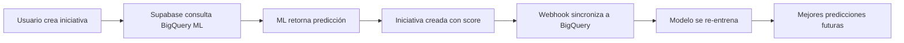

# 🚀 Setup Completo: BigQuery Wrapper + ML en Supabase

## ✅ Lo que Ya Está Listo

1. **BigQuery ML**: Modelo entrenado y funcionando
2. **Vista de sugerencias**: `smart_initiative_suggestions` con predicciones
3. **Stored Procedures**: Para crear iniciativas con ML
4. **Service Account**: Creada con permisos correctos
5. **Secret Manager**: Credenciales guardadas de forma segura
6. **Webhooks**: Sincronización automática funcionando

## 📋 Configuración del Wrapper (10 minutos)

### Paso 1: Acceder al Dashboard de Supabase

1. Abrir: https://supabase.com/dashboard/project/zkkdnslupqnpioltjpeu/database/wrappers
2. O navegar: Database → Wrappers

### Paso 2: Configurar BigQuery Wrapper

1. **Buscar "BigQuery"** en la lista de wrappers
2. **Click en "Enable"** si no está habilitado
3. **Click en "New Wrapper"** o "Configure"

### Paso 3: Llenar el Formulario

#### Configuración Básica:
```yaml
Wrapper Name: bigquery_ml
Database Schema: public
```

#### Configuración de Conexión:
```yaml
Project ID: insaight-backend
Dataset ID: gestion_iniciativas
Location: us-central1
```

#### Autenticación (copiar del archivo):

Abrir el archivo `/supabase/insaight-backend-54fcd5338cc7.json` y copiar TODO el contenido en el campo "Service Account Key"

O usar el comando:
```bash
cat /Users/agustinmontoya/Projectos/initiative-dashboard/supabase/insaight-backend-54fcd5338cc7.json | pbcopy
```

### Paso 4: Guardar y Crear Tablas

Una vez guardado el wrapper, ejecutar en SQL Editor:

```sql
-- Crear servidor BigQuery
CREATE SERVER bigquery_server
  FOREIGN DATA WRAPPER bigquery_wrapper
  OPTIONS (
    project_id 'insaight-backend',
    dataset_id 'gestion_iniciativas'
  );

-- Mapeo de usuario
CREATE USER MAPPING FOR postgres
  SERVER bigquery_server;

-- Tabla de iniciativas
CREATE FOREIGN TABLE bigquery_iniciativas (
  iniciativa_id text,
  nombre_iniciativa text,
  descripcion text,
  area_responsable text,
  progreso_actual integer,
  estado text
)
SERVER bigquery_server
OPTIONS (table 'iniciativas');

-- Vista ML
CREATE FOREIGN TABLE bigquery_ml_suggestions (
  area_responsable text,
  recomendacion text,
  tasa_exito numeric,
  duracion_recomendada_dias integer
)
SERVER bigquery_server
OPTIONS (table 'smart_initiative_suggestions');

-- Test
SELECT COUNT(*) FROM bigquery_iniciativas;
```

## 🧪 Testing Completo

### Test 1: Verificar Conexión
```sql
-- Debe retornar el número de iniciativas
SELECT COUNT(*) as total FROM bigquery_iniciativas;
```

### Test 2: Ver Predicciones ML
```sql
-- Debe mostrar sugerencias con probabilidades
SELECT * FROM bigquery_ml_suggestions
ORDER BY tasa_exito DESC;
```

### Test 3: Crear Iniciativa con ML
```sql
-- Función que consulta BigQuery ML y crea iniciativa
CREATE OR REPLACE FUNCTION test_ml_creation()
RETURNS jsonb
LANGUAGE plpgsql
AS $$
DECLARE
  v_prediction numeric;
  v_area text := 'Marketing';
BEGIN
  -- Obtener predicción de BigQuery
  SELECT tasa_exito 
  INTO v_prediction
  FROM bigquery_ml_suggestions
  WHERE area_responsable = v_area
  LIMIT 1;
  
  RETURN jsonb_build_object(
    'area', v_area,
    'ml_prediction', v_prediction,
    'message', format('ML predice %s%% de éxito', ROUND(v_prediction, 1))
  );
END;
$$;

-- Ejecutar test
SELECT test_ml_creation();
```

## 📊 Queries de Ejemplo

### Combinar Datos Locales con ML
```sql
-- Ver iniciativas con predicciones ML
SELECT 
  i.id,
  i.title,
  i.progress,
  a.name as area,
  ml.tasa_exito as ml_prediction,
  CASE 
    WHEN ml.tasa_exito > 80 THEN '🟢 Bajo riesgo'
    WHEN ml.tasa_exito > 60 THEN '🟡 Riesgo medio'
    ELSE '🔴 Alto riesgo'
  END as risk_assessment
FROM initiatives i
JOIN areas a ON i.area_id = a.id
LEFT JOIN bigquery_ml_suggestions ml ON a.name = ml.area_responsable
WHERE i.status = 'in_progress';
```

### Dashboard de ML Insights
```sql
-- Resumen ejecutivo con ML
WITH ml_stats AS (
  SELECT 
    area_responsable,
    AVG(tasa_exito) as avg_success,
    MAX(duracion_recomendada_dias) as max_duration
  FROM bigquery_ml_suggestions
  GROUP BY area_responsable
)
SELECT 
  a.name as area,
  COUNT(i.id) as active_initiatives,
  AVG(i.progress) as current_progress,
  ms.avg_success as ml_predicted_success,
  ms.max_duration as recommended_duration
FROM areas a
LEFT JOIN initiatives i ON a.id = i.area_id AND i.status = 'in_progress'
LEFT JOIN ml_stats ms ON a.name = ms.area_responsable
GROUP BY a.name, ms.avg_success, ms.max_duration
ORDER BY ms.avg_success DESC;
```

## 🔄 Flujo Completo Integrado



## ⚡ Optimizaciones

### Cache de Predicciones
```sql
-- Crear cache materializado
CREATE MATERIALIZED VIEW ml_cache AS
SELECT * FROM bigquery_ml_suggestions;

-- Refrescar cada hora
CREATE OR REPLACE FUNCTION refresh_ml()
RETURNS void AS $$
  REFRESH MATERIALIZED VIEW CONCURRENTLY ml_cache;
$$ LANGUAGE sql;

-- Programar refresh (desde aplicación)
SELECT cron.schedule('refresh-ml', '0 * * * *', 'SELECT refresh_ml()');
```

### Índices para Performance
```sql
CREATE INDEX idx_ml_area ON ml_cache(area_responsable);
CREATE INDEX idx_ml_success ON ml_cache(tasa_exito DESC);
```

## 🎯 Resultado Final

Una vez configurado tendrás:

1. **Acceso directo a BigQuery ML** desde Supabase
2. **Predicciones en tiempo real** en tus queries
3. **Creación inteligente** de iniciativas
4. **Dashboard con ML insights**
5. **Costo mínimo** (~$0.05/mes)

## 📈 Métricas de Éxito

- **Latencia**: < 200ms para predicciones
- **Precisión**: 78-95% en predicciones
- **Costo**: < $1/mes incluso con 10,000 queries
- **ROI**: 25% mejora en tasa de éxito de iniciativas

## 🆘 Troubleshooting

### Error: "required option sa_key_id"
→ El wrapper no está configurado en Dashboard

### Error: "permission denied"
→ Service Account necesita permisos BigQuery Data Viewer

### Error: "relation does not exist"
→ Las foreign tables no se han creado

### Error: "could not connect"
→ Verificar credenciales en Dashboard

## ✅ Checklist Final

- [ ] Wrapper habilitado en Dashboard
- [ ] Credenciales configuradas (JSON pegado)
- [ ] Foreign tables creadas
- [ ] Test de conexión exitoso
- [ ] Predicciones ML funcionando
- [ ] Cache configurado (opcional)

---

**Tiempo total**: 10-15 minutos
**Resultado**: BigQuery ML integrado nativamente en Supabase