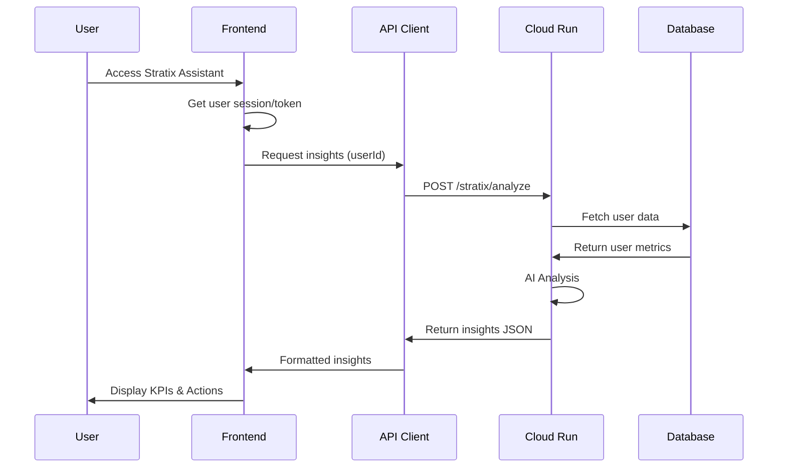

# Stratix Assistant Implementation Roadmap

## Executive Summary

The Stratix Assistant is an AI-powered intelligent advisor that will be integrated into the existing initiative-dashboard application. It provides personalized KPIs, diagnostics, and action plans by analyzing user data through a Cloud Run backend service. This roadmap details a phased approach that ensures seamless integration with the existing glassmorphism design system while maintaining the current application's functionality.

## 1. UX Strategy and Design

### 1.1 Integration Approach
The Stratix Assistant will be added as a new primary navigation item in the existing dashboard, appearing alongside "Overview", "Initiatives", "Areas", and "Analytics".

### 1.2 User Experience Flow

#### Entry Point
- New navigation tab: "AI Assistant" with icon (Brain or Sparkles from lucide-react)
- Badge notification for new insights/recommendations
- Quick access button in the dashboard header for immediate assistance

#### Main Interface Design
```
┌─────────────────────────────────────────────────────────────┐
│  Stratix Assistant                                          │
├─────────────────────────────────────────────────────────────┤
│  ┌─────────────────────────┐  ┌──────────────────────────┐ │
│  │  Assistant Chat          │  │  Insights Dashboard      │ │
│  │  ┌───────────────────┐  │  │  ┌────────────────────┐ │ │
│  │  │ Welcome message    │  │  │  │ KPI Cards          │ │ │
│  │  │ & quick actions    │  │  │  │ - Progress Rate    │ │ │
│  │  └───────────────────┘  │  │  │ - Risk Score       │ │ │
│  │  ┌───────────────────┐  │  │  │ - Efficiency Index │ │ │
│  │  │ User Query        │  │  │  └────────────────────┘ │ │
│  │  └───────────────────┘  │  │  ┌────────────────────┐ │ │
│  │  ┌───────────────────┐  │  │  │ Action Plans       │ │ │
│  │  │ AI Response       │  │  │  │ - Priority tasks   │ │ │
│  │  └───────────────────┘  │  │  │ - Timeline         │ │ │
│  │  [Input field]          │  │  └────────────────────┘ │ │
│  └─────────────────────────┘  └──────────────────────────┘ │
└─────────────────────────────────────────────────────────────┘
```

### 1.3 Component Architecture

#### Core Components
1. **StratixAssistant** (Main container)
   - Manages state and data flow
   - Handles API communication
   - Coordinates sub-components

2. **AssistantChat** 
   - Chat interface with message history
   - Quick action buttons
   - Voice input capability (optional)

3. **InsightsDashboard**
   - KPI visualization cards
   - Action plan timeline
   - Diagnostic charts

4. **AssistantLoader**
   - Glassmorphism skeleton loader
   - Progressive data loading indicators

### 1.4 Visual Design Specifications

#### Glassmorphism Theme Integration
```css
/* Assistant Container */
.stratix-assistant-container {
  @apply backdrop-blur-xl bg-white/5 border border-white/10;
  @apply rounded-xl shadow-2xl;
}

/* KPI Cards */
.kpi-card {
  @apply backdrop-blur-md bg-gradient-to-br from-purple-500/10 to-cyan-500/10;
  @apply border border-white/20 rounded-lg p-6;
  @apply hover:shadow-lg transition-all duration-300;
}

/* Chat Messages */
.assistant-message {
  @apply backdrop-blur-sm bg-cyan-500/10 rounded-lg p-4;
  @apply border-l-4 border-cyan-500;
}

.user-message {
  @apply backdrop-blur-sm bg-purple-500/10 rounded-lg p-4;
  @apply border-l-4 border-purple-500;
}
```

### 1.5 Interaction Patterns

#### Loading States
- Shimmer effect on KPI cards while loading
- Typing indicator for assistant responses
- Progressive data revelation

#### Error Handling
- Graceful fallbacks with retry options
- Offline mode with cached insights
- Clear error messaging with suggested actions

## 2. Technical Architecture

### 2.1 Project Structure
```
app/
├── stratix-assistant/
│   ├── page.tsx                    # Main assistant page
│   └── loading.tsx                 # Loading state
│
components/
├── stratix/
│   ├── StratixAssistant.tsx       # Main container component
│   ├── AssistantChat.tsx          # Chat interface
│   ├── InsightsDashboard.tsx      # KPI & insights display
│   ├── AssistantLoader.tsx        # Loading states
│   ├── KPICard.tsx                # Individual KPI display
│   ├── ActionPlanTimeline.tsx     # Action items visualization
│   └── DiagnosticChart.tsx        # Analytics charts
│
lib/
├── stratix/
│   ├── api-client.ts              # Cloud Run API client
│   ├── types.ts                   # TypeScript interfaces
│   └── utils.ts                   # Helper functions
│
hooks/
├── useStratixAssistant.ts         # Main assistant hook
├── useStratixInsights.ts          # Insights data hook
└── useStratixChat.ts              # Chat functionality hook
```

### 2.2 Data Flow Architecture



### 2.3 API Client Design

```typescript
// lib/stratix/api-client.ts
export class StratixAPIClient {
  private baseURL: string;
  private token: string;

  constructor(token: string) {
    this.baseURL = process.env.NEXT_PUBLIC_STRATIX_API_URL!;
    this.token = token;
  }

  async getInsights(userId: string): Promise<StratixInsights> {
    const response = await fetch(`${this.baseURL}/analyze`, {
      method: 'POST',
      headers: {
        'Authorization': `Bearer ${this.token}`,
        'Content-Type': 'application/json',
      },
      body: JSON.stringify({ userId }),
    });

    if (!response.ok) {
      throw new StratixAPIError(response.status, await response.text());
    }

    return response.json();
  }

  async sendQuery(userId: string, query: string): Promise<StratixResponse> {
    // Similar implementation for chat queries
  }
}
```

### 2.4 Type Definitions

```typescript
// lib/stratix/types.ts
export interface StratixInsights {
  kpis: KPI[];
  diagnostics: Diagnostic[];
  actionPlans: ActionPlan[];
  timestamp: string;
}

export interface KPI {
  id: string;
  name: string;
  value: number;
  unit: string;
  trend: 'up' | 'down' | 'stable';
  description: string;
  category: 'performance' | 'risk' | 'efficiency';
}

export interface ActionPlan {
  id: string;
  title: string;
  description: string;
  priority: 'high' | 'medium' | 'low';
  dueDate: string;
  relatedKPIs: string[];
  steps: ActionStep[];
}
```

### 2.5 State Management

```typescript
// hooks/useStratixAssistant.ts
export function useStratixAssistant() {
  const { user } = useAuth();
  const [insights, setInsights] = useState<StratixInsights | null>(null);
  const [loading, setLoading] = useState(true);
  const [error, setError] = useState<Error | null>(null);

  useEffect(() => {
    if (user?.id) {
      loadInsights(user.id);
    }
  }, [user?.id]);

  const loadInsights = async (userId: string) => {
    try {
      setLoading(true);
      const client = new StratixAPIClient(user.token);
      const data = await client.getInsights(userId);
      setInsights(data);
    } catch (err) {
      setError(err as Error);
    } finally {
      setLoading(false);
    }
  };

  return { insights, loading, error, refresh: () => loadInsights(user.id) };
}
```

## 3. Implementation Phases

### Phase 1: Foundation (Week 1-2)

#### Tasks:
1. **Setup API Client Infrastructure**
   - Create `lib/stratix/api-client.ts`
   - Define TypeScript interfaces in `lib/stratix/types.ts`
   - Configure environment variables for Cloud Run endpoint

2. **Create Base Components**
   - Implement `StratixAssistant.tsx` container
   - Build `AssistantLoader.tsx` with glassmorphism styling
   - Setup routing in `app/stratix-assistant/page.tsx`

3. **Implement Authentication Flow**
   - Extract user token from session
   - Add token to API requests
   - Handle authentication errors

#### Deliverables:
- Working API client with mock responses
- Basic component structure
- Authentication integration

### Phase 2: Core Features (Week 3-4)

#### Tasks:
1. **Build KPI Dashboard**
   - Implement `KPICard.tsx` component
   - Create `InsightsDashboard.tsx` layout
   - Add chart visualizations using Recharts

2. **Develop Chat Interface**
   - Build `AssistantChat.tsx` component
   - Implement message history
   - Add real-time response streaming

3. **Connect to Backend**
   - Replace mock data with real API calls
   - Implement error handling
   - Add retry logic

#### Deliverables:
- Functional KPI visualization
- Working chat interface
- Live backend integration

### Phase 3: Enhanced Features (Week 5-6)

#### Tasks:
1. **Action Plans Implementation**
   - Build `ActionPlanTimeline.tsx`
   - Add task management features
   - Implement priority filtering

2. **Advanced Analytics**
   - Create `DiagnosticChart.tsx`
   - Add trend analysis
   - Implement comparison views

3. **Performance Optimization**
   - Add response caching
   - Implement lazy loading
   - Optimize re-renders

#### Deliverables:
- Complete action planning system
- Advanced analytics views
- Optimized performance

### Phase 4: Polish & Integration (Week 7-8)

#### Tasks:
1. **UI/UX Refinements**
   - Fine-tune animations
   - Enhance mobile responsiveness
   - Add keyboard shortcuts

2. **Integration Testing**
   - Test with production backend
   - Verify data accuracy
   - Load testing

3. **Documentation & Training**
   - Create user guides
   - Document API integration
   - Prepare deployment guide

#### Deliverables:
- Polished, production-ready feature
- Complete documentation
- Deployment package

## 4. Risk Assessment & Mitigation

### Technical Risks

1. **API Latency**
   - Risk: Slow response from Cloud Run service
   - Mitigation: Implement aggressive caching, show progressive loading

2. **Authentication Complexity**
   - Risk: Token management issues
   - Mitigation: Use existing auth infrastructure, add token refresh logic

3. **Data Volume**
   - Risk: Large datasets causing performance issues
   - Mitigation: Implement pagination, virtual scrolling

### UX Risks

1. **Feature Discovery**
   - Risk: Users not finding the new assistant
   - Mitigation: Add onboarding tour, prominent navigation

2. **Trust in AI Recommendations**
   - Risk: Users questioning AI insights
   - Mitigation: Show data sources, add explanation tooltips

## 5. Success Metrics

### Technical Metrics
- API response time < 2 seconds
- 99.9% uptime
- Zero critical bugs in production

### User Metrics
- 80% of users try the assistant within first week
- 60% weekly active usage
- 4.5+ user satisfaction rating

### Business Metrics
- 20% improvement in KPI achievement
- 30% reduction in planning time
- 25% increase in user engagement

## 6. Next Steps

1. **Immediate Actions**
   - Set up development environment
   - Configure Cloud Run endpoint access
   - Create feature branch: `feature/stratix-assistant`

2. **Team Coordination**
   - Backend team: Finalize API contract
   - Design team: Review UI mockups
   - QA team: Prepare test scenarios

3. **Launch Preparation**
   - Plan phased rollout strategy
   - Prepare user communication
   - Set up monitoring dashboards

## Conclusion

The Stratix Assistant implementation follows a methodical approach that prioritizes user experience while ensuring technical robustness. By leveraging the existing glassmorphism design system and component library, we can deliver a cohesive, powerful feature that enhances the initiative dashboard's value proposition.

The phased implementation allows for iterative feedback and reduces risk, while the comprehensive architecture ensures scalability and maintainability. With proper execution of this roadmap, the Stratix Assistant will become an indispensable tool for users to optimize their strategic initiatives.