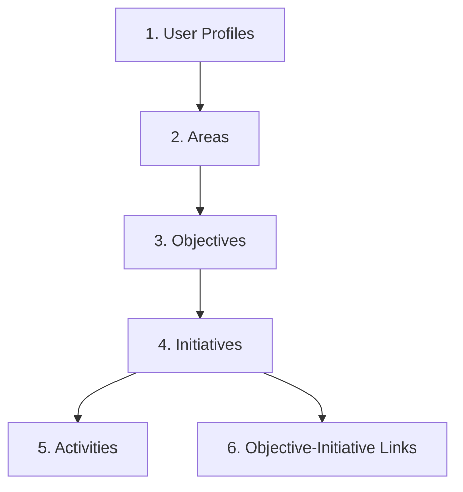
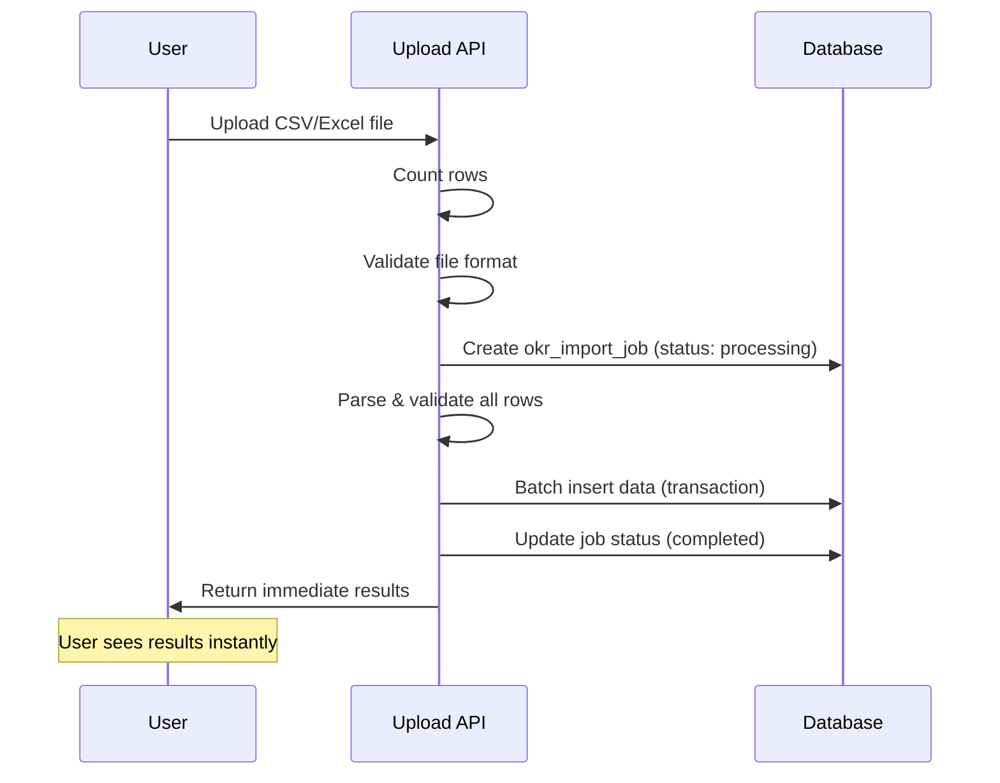
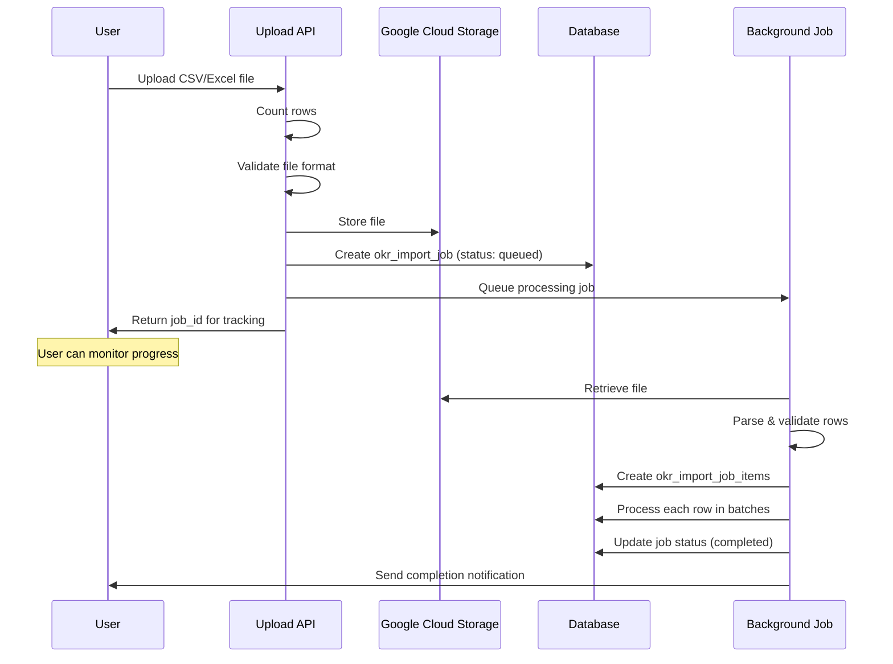

# OKR Data Import - Field Mapping Specification

## Executive Summary
This document defines the comprehensive field mapping for importing OKR (Objectives and Key Results) data into the Initiative Dashboard system. It specifies required and optional fields for each entity, their database mappings, validation rules, and import order requirements.

## Table of Contents
1. [Import Order & Dependencies](#import-order--dependencies)
2. [Entity Field Mappings](#entity-field-mappings)
3. [Validation Rules](#validation-rules)
4. [Error Handling](#error-handling)
5. [Template Specifications](#template-specifications)

---

## Import Order & Dependencies

The following import order MUST be followed to maintain referential integrity:



---

## Entity Field Mappings

### 1. User Profiles Import
**Table**: `user_profiles`
**Purpose**: Import system users who will create and manage OKRs

#### Required Fields
| CSV Column | Database Field | Type | Description | Validation |
|------------|---------------|------|-------------|------------|
| email | email | text | User email address | Valid email format (regex: `^[A-Za-z0-9._%-]+@[A-Za-z0-9.-]+[.][A-Za-z]+$`) |
| role | role | enum | User role in system | Must be: CEO, Admin, or Manager |
| full_name | full_name | text | User's display name | Non-empty string |

#### Optional Fields
| CSV Column | Database Field | Type | Description | Default Value |
|------------|---------------|------|-------------|---------------|
| area_name | area_id | uuid (lookup) | Area assignment | NULL |
| phone | phone | text | Contact number | NULL |
| is_active | is_active | boolean | Account status | true |

#### System-Generated Fields (Not in CSV)
- `id`: uuid - Auto-generated
- `tenant_id`: uuid - From session context
- `user_id`: uuid - Created during auth sync
- `created_at`: timestamp - Current timestamp
- `updated_at`: timestamp - Current timestamp
- `avatar_url`: text - NULL (set later via UI)
- `is_system_admin`: boolean - false
- `last_login`: timestamp - NULL

---

### 2. Areas Import
**Table**: `areas`
**Purpose**: Import organizational departments or teams

#### Required Fields
| CSV Column | Database Field | Type | Description | Validation |
|------------|---------------|------|-------------|------------|
| name | name | text | Area name | Non-empty, unique per tenant |

#### Optional Fields
| CSV Column | Database Field | Type | Description | Default Value |
|------------|---------------|------|-------------|---------------|
| description | description | text | Area description | NULL |
| manager_email | manager_id | uuid (lookup) | Area manager | NULL (lookup by email) |
| is_active | is_active | boolean | Area status | true |

#### System-Generated Fields (Not in CSV)
- `id`: uuid - Auto-generated
- `tenant_id`: uuid - From session context
- `created_at`: timestamp - Current timestamp
- `updated_at`: timestamp - Current timestamp

---

### 3. Objectives Import
**Table**: `objectives`
**Purpose**: Import strategic objectives

#### Required Fields
| CSV Column | Database Field | Type | Description | Validation |
|------------|---------------|------|-------------|------------|
| title | title | text | Objective title | Non-empty string |
| start_date | start_date | date | Start date | Valid date format (YYYY-MM-DD) |

#### Optional Fields
| CSV Column | Database Field | Type | Description | Default Value |
|------------|---------------|------|-------------|---------------|
| description | description | text | Detailed description | NULL |
| area_name | area_id | uuid (lookup) | Associated area | NULL (lookup by name) |
| end_date | end_date | date | End date | NULL |
| target_date | target_date | date | Target completion | Same as end_date |
| priority | priority | enum | Priority level | 'medium' (high/medium/low) |
| status | status | enum | Current status | 'planning' (planning/in_progress/completed/overdue) |
| progress | progress | integer | Completion % | 0 (0-100) |
| metrics | metrics | jsonb | Success metrics | '[]' |

#### System-Generated Fields (Not in CSV)
- `id`: uuid - Auto-generated
- `tenant_id`: uuid - From session context
- `created_by`: uuid - From session user
- `created_at`: timestamp - Current timestamp
- `updated_at`: timestamp - Current timestamp
- `quarter`: text - DEPRECATED (NULL)

---

### 4. Initiatives Import
**Table**: `initiatives`
**Purpose**: Import tactical initiatives linked to objectives

#### Required Fields
| CSV Column | Database Field | Type | Description | Validation |
|------------|---------------|------|-------------|------------|
| title | title | text | Initiative title | Non-empty string |
| area_name | area_id | uuid (lookup) | Owning area | Must exist (lookup by name) |

#### Optional Fields
| CSV Column | Database Field | Type | Description | Default Value |
|------------|---------------|------|-------------|---------------|
| description | description | text | Detailed description | NULL |
| start_date | start_date | date | Start date | Current date |
| due_date | due_date | date | Due date | NULL |
| progress | progress | integer | Completion % | 0 (0-100) |
| status | status | enum | Current status | 'in_progress' (planning/in_progress/completed/on_hold) |
| objective_title | - | text (link) | Link to objective | Creates objective_initiatives record |

#### System-Generated Fields (Not in CSV)
- `id`: uuid - Auto-generated
- `tenant_id`: uuid - From session context
- `created_by`: uuid - From session user
- `completion_date`: date - NULL (set when completed)
- `created_at`: timestamp - Current timestamp
- `updated_at`: timestamp - Current timestamp

---

### 5. Activities Import
**Table**: `activities`
**Purpose**: Import granular tasks within initiatives

#### Required Fields
| CSV Column | Database Field | Type | Description | Validation |
|------------|---------------|------|-------------|------------|
| title | title | text | Activity title | Non-empty string |
| initiative_title | initiative_id | uuid (lookup) | Parent initiative | Must exist (lookup by title) |

#### Optional Fields
| CSV Column | Database Field | Type | Description | Default Value |
|------------|---------------|------|-------------|---------------|
| description | description | text | Activity details | NULL |
| assigned_to_email | assigned_to | uuid (lookup) | Assignee | NULL (lookup by email) |
| is_completed | is_completed | boolean | Completion status | false |

#### System-Generated Fields (Not in CSV)
- `id`: uuid - Auto-generated
- `created_at`: timestamp - Current timestamp
- `updated_at`: timestamp - Current timestamp

---

### 6. Objective-Initiative Links Import
**Table**: `objective_initiatives`
**Purpose**: Link initiatives to objectives (many-to-many)

#### Required Fields
| CSV Column | Database Field | Type | Description | Validation |
|------------|---------------|------|-------------|------------|
| objective_title | objective_id | uuid (lookup) | Objective reference | Must exist (lookup by title) |
| initiative_title | initiative_id | uuid (lookup) | Initiative reference | Must exist (lookup by title) |

#### System-Generated Fields (Not in CSV)
- `id`: uuid - Auto-generated

---

## Validation Rules

### Global Validation Rules
1. **Tenant Isolation**: All imported data automatically assigned to user's tenant
2. **Duplicate Detection**: Based on unique identifiers per entity
3. **Character Encoding**: UTF-8 required
4. **File Size Limit**: 10MB maximum
5. **Row Limit**: 10,000 rows per import

### Field-Specific Validations

#### Email Validation
```regex
^[A-Za-z0-9._%-]+@[A-Za-z0-9.-]+[.][A-Za-z]+$
```

#### Date Validation
- Format: YYYY-MM-DD
- Logical checks:
  - start_date <= end_date
  - due_date >= current_date (warning if not)

#### Progress Validation
- Range: 0-100
- Integer only
- Automatic calculation from activities if not provided

#### Status Validations
- **Objectives**: planning, in_progress, completed, overdue
- **Initiatives**: planning, in_progress, completed, on_hold
- **Activities**: true/false (is_completed)

#### Role Validations
- **User Roles**: CEO, Admin, Manager
- **Priority Levels**: high, medium, low

---

## Error Handling

### Error Categories

#### Critical Errors (Stop Import)
- Missing required fields
- Invalid tenant context
- Database connection failure
- File format issues

#### Row-Level Errors (Skip Row)
- Invalid email format
- Non-existent foreign key references
- Out-of-range values
- Date logic violations

#### Warnings (Import with Notes)
- Duplicate entries (update existing)
- Future due dates
- Missing optional relationships

### Error Response Format

#### Synchronous Response (≤ 25 rows)
```json
{
  "success": true,
  "processing_mode": "synchronous",
  "summary": {
    "total_rows": 23,
    "success_rows": 21,
    "error_rows": 2,
    "warning_rows": 5,
    "processing_time_ms": 1250
  },
  "data": {
    "created": {
      "objectives": 10,
      "initiatives": 20,
      "activities": 13
    }
  },
  "errors": [
    {
      "row": 5,
      "field": "email",
      "value": "invalid-email",
      "error": "import.errors.invalid_email_format",
      "error_params": { "value": "invalid-email" }
    }
  ],
  "warnings": [
    {
      "row": 12,
      "message": "import.warnings.due_date_past",
      "message_params": { "date": "2024-12-31" }
    }
  ]
}
```

#### Asynchronous Response (> 25 rows)
```json
{
  "success": true,
  "processing_mode": "asynchronous",
  "job_id": "550e8400-e29b-41d4-a716-446655440000",
  "status": "queued",
  "message": "File queued for processing. Use job_id to track progress.",
  "tracking_url": "/api/import/status/550e8400-e29b-41d4-a716-446655440000",
  "estimated_time_seconds": 30,
  "total_rows": 500
}
```

#### Status Polling Response (Async)
```json
{
  "job_id": "550e8400-e29b-41d4-a716-446655440000",
  "status": "processing",
  "progress": {
    "total_rows": 500,
    "processed_rows": 125,
    "success_rows": 120,
    "error_rows": 5,
    "percentage": 25
  },
  "estimated_time_remaining_seconds": 22
}
```

---

## Template Specifications

### CSV Template Headers

#### user_profiles.csv
```csv
email,full_name,role,area_name,phone,is_active
```

#### areas.csv
```csv
name,description,manager_email,is_active
```

#### objectives.csv
```csv
title,description,area_name,start_date,end_date,priority,status,progress,metrics
```

#### initiatives.csv
```csv
title,description,area_name,objective_title,start_date,due_date,progress,status
```

#### activities.csv
```csv
title,description,initiative_title,assigned_to_email,is_completed
```

### Excel Template Structure
- **Sheet 1**: Instructions & Field Descriptions
- **Sheet 2**: User Profiles
- **Sheet 3**: Areas
- **Sheet 4**: Objectives
- **Sheet 5**: Initiatives
- **Sheet 6**: Activities
- **Sheet 7**: Validation Lists (dropdowns)

---

## Import Process Flow

### Processing Mode Decision

The system automatically determines processing mode based on file size:

| Row Count | Processing Mode | User Experience | Use Case |
|-----------|----------------|-----------------|----------|
| ≤ 25 rows | **Synchronous** | Immediate results | Quick updates, small teams |
| > 25 rows | **Asynchronous** | Background processing | Bulk imports, initial setup |

### Synchronous Processing Flow (≤ 25 rows)



### Asynchronous Processing Flow (> 25 rows)



---

## Implementation Notes

### Performance Considerations

#### Processing Mode Thresholds
- **Synchronous (≤ 25 rows)**: 
  - Direct processing in API request
  - Maximum 5 second timeout
  - Immediate validation feedback
  - Single database transaction
  
- **Asynchronous (> 25 rows)**:
  - Background job processing
  - No timeout constraints
  - Progress tracking via polling/websockets
  - Chunked database transactions

#### Optimization Strategies
- Batch inserts (100 rows at a time for async)
- In-memory processing for sync mode
- Streaming parser for files > 1MB
- Connection pooling for database operations
- Redis queue for job management

### Security Considerations
- File scanning for malware
- Input sanitization
- SQL injection prevention
- Rate limiting per user
- Audit logging of all imports

### Rollback Strategy
- Transaction-based imports
- Rollback on critical errors
- Partial rollback for row-level errors
- Import history with undo capability

---

## Internationalization (i18n)

### Error Message Translation

All error and warning messages use translation keys instead of hardcoded text to support multiple languages:

#### Translation Key Structure
```
import.{severity}.{error_type}
```

#### Common Translation Keys

**Validation Errors:**
- `import.errors.required_field_missing` - Required field is empty
- `import.errors.invalid_email_format` - Email format validation failed
- `import.errors.invalid_date_format` - Date format incorrect
- `import.errors.invalid_enum_value` - Value not in allowed list
- `import.errors.progress_out_of_range` - Progress not between 0-100
- `import.errors.foreign_key_not_found` - Referenced entity doesn't exist
- `import.errors.duplicate_entry` - Duplicate unique value

**Logic Errors:**
- `import.errors.end_date_before_start` - End date is before start date
- `import.errors.circular_dependency` - Circular reference detected
- `import.errors.max_depth_exceeded` - Hierarchy too deep

**Warnings:**
- `import.warnings.due_date_past` - Due date is in the past
- `import.warnings.no_assignment` - Activity has no assignee
- `import.warnings.duplicate_updated` - Existing record updated
- `import.warnings.optional_field_missing` - Optional field not provided

**Success Messages:**
- `import.success.completed` - Import completed successfully
- `import.success.partial` - Import completed with some errors
- `import.info.processing` - File is being processed
- `import.info.queued` - File queued for processing

#### Translation Parameters

Dynamic values are passed as parameters:
```json
{
  "error": "import.errors.progress_out_of_range",
  "error_params": {
    "value": 150,
    "min": 0,
    "max": 100
  }
}
```

Frontend displays: "Progress value 150 is out of range (0-100)"

---

## API Endpoints

### File Upload Endpoint
```
POST /api/import/upload
```

**Request Headers:**
```
Content-Type: multipart/form-data
Authorization: Bearer {token}
```

**Request Body:**
- `file`: File (CSV or Excel)
- `entity_type`: String (objectives|initiatives|activities|areas|users)
- `update_existing`: Boolean (default: false)

**Response:**
- **Synchronous (≤ 25 rows)**: Immediate processing results
- **Asynchronous (> 25 rows)**: Job ID for tracking

### Status Tracking Endpoint (Async only)
```
GET /api/import/status/{job_id}
```

**Response:**
- Current processing status
- Progress percentage
- Errors and warnings
- Estimated completion time

### Download Template Endpoint
```
GET /api/import/template/{entity_type}
```

**Query Parameters:**
- `format`: csv|excel (default: csv)

**Response:**
- File download with proper headers and example data

---

*Document Version: 1.2*
*Last Updated: 2025-01-14*
*Author: System Architecture Team*
*Changes:*
- *v1.1: Added synchronous/asynchronous processing modes*
- *v1.2: Reduced threshold from 50 to 25 rows, added i18n translation keys for errors*