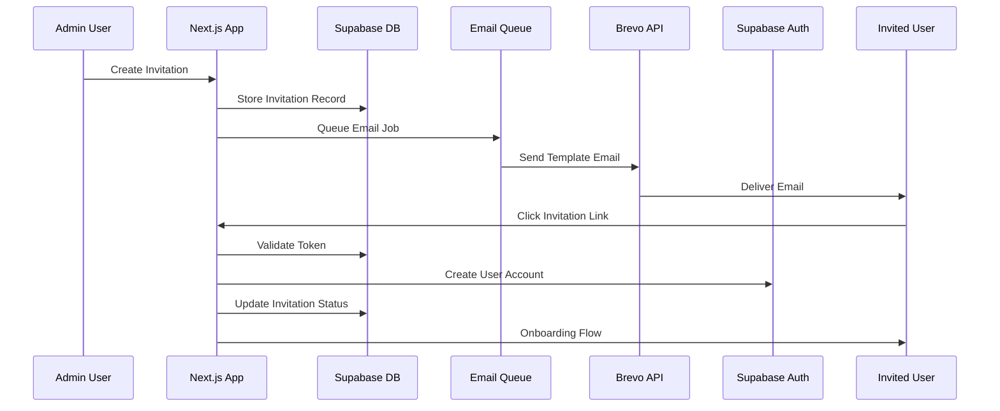

# User Invitation System - Complete Implementation Proposal

## Executive Summary

This document outlines a comprehensive proposal for enhancing the existing user invitation system in the Initiative Dashboard. The system is designed to enable **CEOs and Admins** to invite new users to their organizations with role-based permissions and restrictions. The current implementation uses Supabase's `inviteUserByEmail` but lacks robust email delivery, tracking, and multi-tenant organization features. This proposal integrates Brevo (formerly SendinBlue) for professional email delivery while maintaining Supabase for authentication.

### Key Features for Admin & CEO Users:
- **CEOs**: Can invite any role (CEO, Admin, Manager), manage all invitations, bulk operations (up to 100)
- **Admins**: Can invite Admins and Managers (not CEOs), manage invitations, bulk operations (up to 50)
- **Managers**: View-only access to invitations in their area (cannot create invitations)

## Current State Analysis

### Existing Infrastructure

#### Database Schema
```sql
-- Current invitations table
CREATE TABLE public.invitations (
  id uuid DEFAULT uuid_generate_v4(),
  tenant_id uuid NOT NULL,
  email text NOT NULL,
  role USER-DEFINED NOT NULL,
  area_id uuid,
  status USER-DEFINED DEFAULT 'sent'::invitation_status,
  custom_message text,
  sent_by uuid NOT NULL,
  token text UNIQUE NOT NULL,
  expires_at timestamp with time zone NOT NULL,
  accepted_at timestamp with time zone,
  accepted_by uuid,
  last_reminder_sent timestamp with time zone,
  reminder_count integer DEFAULT 0,
  metadata jsonb DEFAULT '{}'::jsonb,
  created_at timestamp with time zone DEFAULT now(),
  updated_at timestamp with time zone DEFAULT now()
);
```

#### Current Implementation Gaps
1. **Email Delivery**: Relies on Supabase's built-in email which has rate limits (30/hour)
2. **Email Templates**: No customizable professional templates
3. **Tracking**: Limited email open/click tracking
4. **Retry Logic**: No automatic retry for failed emails
5. **Bulk Invitations**: No support for bulk invite operations
6. **Onboarding Flow**: Limited onboarding experience after invitation acceptance

### Available Resources
- ✅ Brevo API Key configured in `.env.local`
- ✅ Existing invitation API endpoints
- ✅ Database structure for invitations
- ✅ Multi-tenant architecture with RLS
- ✅ Role-based permissions (CEO, Admin, Manager)

## Proposed Architecture

### High-Level Flow



## Role-Based Invitation System

### CEO Capabilities
CEOs have full control over the invitation system:
- **Invite any role**: Can invite other CEOs, Admins, and Managers
- **Bulk invitations**: Send up to 100 invitations at once
- **Cross-area invitations**: Assign users to any area in the organization
- **Full management**: Edit, cancel, or delete any invitation
- **Analytics access**: View complete invitation metrics and export data
- **Template management**: Create and manage invitation templates

### Admin Capabilities
Admins have comprehensive invitation permissions with some restrictions:
- **Invite most roles**: Can invite Admins and Managers (but not CEOs)
- **Bulk invitations**: Send up to 50 invitations at once
- **Cross-area invitations**: Assign users to any area
- **Invitation management**: Cancel or resend invitations they created
- **Analytics access**: View invitation metrics and export data
- **Template usage**: Use pre-defined invitation templates

### Manager Limitations
Managers have view-only access:
- **No invitation creation**: Cannot send invitations
- **Limited visibility**: Can only view invitations for their area
- **No bulk operations**: No access to bulk features
- **Read-only analytics**: View basic metrics for their area only

### Invitation Hierarchy Rules
1. **CEO-only privileges**: Only CEOs can invite other CEOs
2. **Downward invitations**: Users can only invite roles at or below their level
3. **Area assignments**: Admins and CEOs can assign to any area; Managers cannot invite
4. **Audit trail**: All invitation actions are logged with inviter details

## Detailed Implementation Plan

### Phase 1: Email Infrastructure (Week 1)

#### 1.1 Brevo Integration Service
Create `/lib/email/brevo-service.ts`:

```typescript
import * as brevo from '@getbrevo/brevo';

interface EmailTemplate {
  INVITATION: 1,
  REMINDER: 2,
  WELCOME: 3,
  EXPIRATION_WARNING: 4
}

class BrevoEmailService {
  private api: brevo.TransactionalEmailsApi;
  
  constructor() {
    const defaultClient = brevo.ApiClient.instance;
    const apiKey = defaultClient.authentications['api-key'];
    apiKey.apiKey = process.env.BREVO_API_KEY;
    this.api = new brevo.TransactionalEmailsApi();
  }

  async sendInvitation(data: InvitationEmailData) {
    const sendSmtpEmail = new brevo.SendSmtpEmail();
    
    sendSmtpEmail.templateId = EmailTemplate.INVITATION;
    sendSmtpEmail.to = [{ email: data.recipientEmail, name: data.recipientName }];
    sendSmtpEmail.params = {
      inviterName: data.inviterName,
      organizationName: data.organizationName,
      roleName: data.roleName,
      customMessage: data.customMessage,
      invitationLink: data.invitationLink,
      expiresIn: data.expiresIn
    };
    
    return await this.api.sendTransacEmail(sendSmtpEmail);
  }
}
```

#### 1.2 Email Queue System
Create `/lib/queue/email-queue.ts`:

```typescript
import { Queue, Worker } from 'bullmq';
import Redis from 'ioredis';

const connection = new Redis({
  host: process.env.REDIS_HOST,
  port: process.env.REDIS_PORT,
  password: process.env.REDIS_PASSWORD
});

export const emailQueue = new Queue('emails', { connection });

// Worker to process email jobs
const emailWorker = new Worker('emails', async (job) => {
  const { type, data } = job.data;
  
  switch(type) {
    case 'invitation':
      await brevoService.sendInvitation(data);
      break;
    case 'reminder':
      await brevoService.sendReminder(data);
      break;
  }
}, { connection });
```

### Phase 2: Enhanced Invitation API (Week 1-2)

#### 2.1 Extended Invitation Model
Update database migration:

```sql
-- Add new columns to invitations table
ALTER TABLE public.invitations ADD COLUMN IF NOT EXISTS
  email_sent_at timestamp with time zone,
  email_opened_at timestamp with time zone,
  email_clicked_at timestamp with time zone,
  onboarding_completed_at timestamp with time zone,
  invitation_type text DEFAULT 'single', -- single, bulk
  parent_invitation_id uuid REFERENCES invitations(id),
  brevo_message_id text,
  device_info jsonb,
  referral_source text;

-- Create invitation_analytics table
CREATE TABLE public.invitation_analytics (
  id uuid DEFAULT gen_random_uuid() PRIMARY KEY,
  invitation_id uuid REFERENCES invitations(id),
  event_type text NOT NULL, -- sent, delivered, opened, clicked, accepted, expired
  event_timestamp timestamp with time zone DEFAULT now(),
  metadata jsonb DEFAULT '{}'::jsonb
);
```

#### 2.2 Enhanced API Endpoints

##### POST /api/invitations/v2/send
```typescript
export async function POST(request: NextRequest) {
  const body = await request.json();
  const { emails, role, areaId, customMessage, sendImmediately = true } = body;
  
  // Validate permissions
  const { userProfile } = await getUserProfile(request);
  if (!['CEO', 'Admin'].includes(userProfile.role)) {
    return NextResponse.json({ error: 'Insufficient permissions' }, { status: 403 });
  }
  
  // Batch processing for multiple emails
  const invitations = [];
  for (const email of emails) {
    // Check existing users/invitations
    const existing = await checkExistingInvitation(email, userProfile.tenant_id);
    if (existing) continue;
    
    // Create invitation record
    const invitation = await createInvitationRecord({
      email,
      role,
      areaId,
      customMessage,
      tenantId: userProfile.tenant_id,
      sentBy: userProfile.id
    });
    
    invitations.push(invitation);
    
    // Queue email
    if (sendImmediately) {
      await emailQueue.add('send-invitation', {
        invitationId: invitation.id,
        templateData: prepareTemplateData(invitation, userProfile)
      });
    }
  }
  
  return NextResponse.json({ 
    success: true, 
    invitations,
    queued: invitations.length 
  });
}
```

##### GET /api/invitations/v2/track
Webhook endpoint for Brevo tracking:

```typescript
export async function POST(request: NextRequest) {
  const webhook = await request.json();
  
  // Verify webhook signature
  if (!verifyBrevoWebhook(request)) {
    return NextResponse.json({ error: 'Invalid signature' }, { status: 401 });
  }
  
  const { event, email, message_id, timestamp } = webhook;
  
  // Update invitation based on event
  switch(event) {
    case 'delivered':
      await updateInvitationStatus(message_id, 'delivered', timestamp);
      break;
    case 'opened':
      await recordInvitationEvent(message_id, 'opened', timestamp);
      break;
    case 'clicked':
      await recordInvitationEvent(message_id, 'clicked', timestamp);
      break;
  }
  
  return NextResponse.json({ received: true });
}
```

### Phase 3: Invitation Acceptance Flow (Week 2)

#### 3.1 Secure Token Validation
Create `/app/auth/accept-invitation/page.tsx`:

```typescript
export default async function AcceptInvitationPage({ searchParams }) {
  const token = searchParams.token;
  
  // Validate token
  const invitation = await validateInvitationToken(token);
  
  if (!invitation) {
    return <InvitationExpiredPage />;
  }
  
  if (invitation.status === 'accepted') {
    return <AlreadyAcceptedPage />;
  }
  
  // Check if user exists
  const existingUser = await checkExistingUser(invitation.email);
  
  if (existingUser) {
    // Link to organization
    return <LinkToOrganizationFlow invitation={invitation} user={existingUser} />;
  }
  
  // New user registration
  return <InvitationRegistrationForm invitation={invitation} />;
}
```

#### 3.2 Onboarding Flow
Create `/components/onboarding/invitation-onboarding.tsx`:

```typescript
const InvitationOnboarding = ({ invitation, user }) => {
  const [step, setStep] = useState(1);
  const steps = [
    { id: 1, name: 'Welcome', component: WelcomeStep },
    { id: 2, name: 'Profile Setup', component: ProfileSetupStep },
    { id: 3, name: 'Team Introduction', component: TeamIntroductionStep },
    { id: 4, name: 'First Task', component: FirstTaskStep }
  ];
  
  return (
    <OnboardingLayout>
      <ProgressBar current={step} total={steps.length} />
      <AnimatePresence mode="wait">
        {steps.map(s => 
          s.id === step && (
            <motion.div key={s.id}>
              <s.component 
                invitation={invitation}
                user={user}
                onNext={() => setStep(step + 1)}
              />
            </motion.div>
          )
        )}
      </AnimatePresence>
    </OnboardingLayout>
  );
};
```

### Phase 4: Admin & CEO Dashboard (Week 2-3)

#### 4.1 Role-Specific Invitation UI
Create different UI experiences based on user role:

##### CEO Dashboard (`/app/ceo/invitations/page.tsx`)
```typescript
export default function CEOInvitationDashboard() {
  return (
    <div className="space-y-6">
      {/* Quick Actions for CEOs */}
      <div className="grid grid-cols-4 gap-4">
        <QuickInviteCard role="CEO" />
        <QuickInviteCard role="Admin" />
        <QuickInviteCard role="Manager" />
        <BulkImportCard maxCount={100} />
      </div>
      
      {/* Organization-wide Statistics */}
      <OrganizationInvitationStats showAllTenants={true} />
      
      {/* Advanced Management Tools */}
      <Tabs>
        <TabPanel title="Active Invitations">
          <InvitationsTable 
            canEdit={true}
            canDelete={true}
            canExport={true}
          />
        </TabPanel>
        <TabPanel title="Templates">
          <InvitationTemplateManager canCreate={true} />
        </TabPanel>
        <TabPanel title="Analytics">
          <InvitationAnalyticsDashboard fullAccess={true} />
        </TabPanel>
      </Tabs>
    </div>
  );
}
```

##### Admin Dashboard (`/app/admin/invitations/page.tsx`)
```typescript
export default function AdminInvitationDashboard() {
  const { profile } = useAuth();
  
  return (
    <div className="space-y-6">
      {/* Quick Actions for Admins */}
      <div className="grid grid-cols-3 gap-4">
        <QuickInviteCard role="Admin" />
        <QuickInviteCard role="Manager" />
        <BulkImportCard maxCount={50} />
      </div>
      
      {/* Filtered Invitation List */}
      <InvitationManagement
        allowedRoles={['Admin', 'Manager']}
        showStats={true}
        canCancel={true}
        canResend={true}
        cannotInviteRoles={['CEO']} // Highlight restriction
      />
      
      {/* Activity Log */}
      <RecentInvitationActivity 
        filterByCreator={false} // Admins see all
      />
    </div>
  );
}
```

#### 4.2 Invitation Management UI
Create `/app/org-admin/invitations/dashboard/page.tsx`:

```typescript
export default function InvitationsDashboard() {
  return (
    <div className="space-y-6">
      {/* Statistics Cards */}
      <InvitationStats />
      
      {/* Bulk Actions */}
      <div className="flex gap-4">
        <BulkInviteModal />
        <ImportCSVModal />
        <ResendExpiredButton />
      </div>
      
      {/* Invitations Table with Filters */}
      <InvitationsTable
        columns={[
          'email',
          'role',
          'status',
          'sentAt',
          'openedAt',
          'acceptedAt',
          'actions'
        ]}
        filters={{
          status: ['pending', 'sent', 'opened', 'accepted', 'expired'],
          dateRange: true,
          search: true
        }}
      />
      
      {/* Analytics Charts */}
      <div className="grid grid-cols-2 gap-6">
        <InvitationFunnelChart />
        <AcceptanceRateChart />
      </div>
    </div>
  );
}
```

#### 4.2 Real-time Updates
Implement WebSocket for real-time invitation updates:

```typescript
// hooks/useInvitationUpdates.ts
export function useInvitationUpdates() {
  const [invitations, setInvitations] = useState([]);
  
  useEffect(() => {
    const channel = supabase
      .channel('invitations')
      .on('postgres_changes', 
        { 
          event: '*', 
          schema: 'public', 
          table: 'invitations',
          filter: `tenant_id=eq.${tenantId}`
        }, 
        (payload) => {
          handleRealtimeUpdate(payload);
        }
      )
      .subscribe();
      
    return () => {
      channel.unsubscribe();
    };
  }, []);
  
  return { invitations };
}
```

### Phase 5: Advanced Features (Week 3)

#### 5.1 Smart Reminders
Automated reminder system:

```typescript
// lib/cron/invitation-reminders.ts
export async function processInvitationReminders() {
  // Find invitations that need reminders
  const pendingInvitations = await getPendingInvitations({
    sentBefore: subDays(new Date(), 3),
    reminderCount: { lt: 3 }
  });
  
  for (const invitation of pendingInvitations) {
    // Check if should send reminder
    if (shouldSendReminder(invitation)) {
      await emailQueue.add('send-reminder', {
        invitationId: invitation.id,
        reminderNumber: invitation.reminder_count + 1
      });
      
      await updateReminderCount(invitation.id);
    }
  }
}
```

#### 5.2 Invitation Templates
Pre-defined invitation templates:

```typescript
const invitationTemplates = {
  manager: {
    subject: 'You're invited to join as a Manager',
    customMessage: 'We're excited to have you lead our {areaName} team...',
    onboardingFlow: 'manager'
  },
  admin: {
    subject: 'Admin access invitation',
    customMessage: 'You've been granted admin privileges...',
    onboardingFlow: 'admin'
  }
};
```

## Security Considerations

### 1. Token Security
- Use cryptographically secure random tokens (UUID v4)
- Implement token expiration (7 days default)
- One-time use tokens
- Rate limiting on acceptance endpoint

### 2. Email Security
- SPF, DKIM, DMARC configuration for domain
- Verify webhook signatures from Brevo
- Sanitize all user inputs in emails
- Implement email validation

### 3. Permission Checks

#### Role-Based Invitation Permissions
```typescript
const invitationPermissions = {
  CEO: {
    actions: ['create', 'read', 'update', 'delete', 'bulk', 'resend'],
    canInviteRoles: ['CEO', 'Admin', 'Manager'],
    canInviteToAnyArea: true,
    canViewAllInvitations: true,
    canExportData: true,
    maxBulkInvites: 100
  },
  Admin: {
    actions: ['create', 'read', 'update', 'cancel', 'resend'],
    canInviteRoles: ['Admin', 'Manager'], // Cannot invite other CEOs
    canInviteToAnyArea: true,
    canViewAllInvitations: true,
    canExportData: true,
    maxBulkInvites: 50
  },
  Manager: {
    actions: ['read'],
    canInviteRoles: [], // Cannot invite users
    canInviteToAnyArea: false,
    canViewAllInvitations: false, // Only their area
    canExportData: false,
    maxBulkInvites: 0
  }
};
```

#### Enhanced Permission Validation
```typescript
// Validate invitation permissions
export async function validateInvitationPermissions(
  inviter: UserProfile,
  inviteeRole: string,
  inviteeAreaId?: string
): Promise<{ allowed: boolean; reason?: string }> {
  const permissions = invitationPermissions[inviter.role];
  
  // Check if inviter can invite this role
  if (!permissions.canInviteRoles.includes(inviteeRole)) {
    return {
      allowed: false,
      reason: `${inviter.role} cannot invite users with ${inviteeRole} role`
    };
  }
  
  // Check area restrictions
  if (inviteeAreaId && !permissions.canInviteToAnyArea) {
    if (inviter.area_id !== inviteeAreaId) {
      return {
        allowed: false,
        reason: 'You can only invite users to your own area'
      };
    }
  }
  
  // CEO-specific rule: Only CEOs can invite other CEOs
  if (inviteeRole === 'CEO' && inviter.role !== 'CEO') {
    return {
      allowed: false,
      reason: 'Only CEOs can invite other CEOs'
    };
  }
  
  return { allowed: true };
}
```

### 4. Data Privacy
- GDPR compliance for EU users
- Option to delete invitation data
- Audit trail for all invitation actions
- Encrypted storage of sensitive data

## Performance Optimizations

### 1. Database Indexes
```sql
CREATE INDEX idx_invitations_email_tenant ON invitations(email, tenant_id);
CREATE INDEX idx_invitations_status_expires ON invitations(status, expires_at);
CREATE INDEX idx_invitations_sent_by ON invitations(sent_by);
CREATE INDEX idx_invitation_analytics_invitation ON invitation_analytics(invitation_id);
```

### 2. Caching Strategy
- Redis cache for frequently accessed invitations
- Cache invitation statistics (TTL: 5 minutes)
- Use SWR for client-side caching

### 3. Batch Operations
- Bulk invite up to 100 users at once
- Batch email sending via queue
- Aggregate analytics updates

## Monitoring & Analytics

### 1. Key Metrics
```typescript
const invitationMetrics = {
  // Delivery metrics
  sentRate: 'invitations_sent / total_invitations',
  deliveryRate: 'delivered / sent',
  openRate: 'opened / delivered',
  clickRate: 'clicked / opened',
  
  // Acceptance metrics
  acceptanceRate: 'accepted / sent',
  timeToAccept: 'avg(accepted_at - sent_at)',
  expirationRate: 'expired / sent',
  
  // User metrics
  onboardingCompletion: 'onboarding_completed / accepted',
  firstActionTime: 'avg(first_action_at - accepted_at)'
};
```

### 2. Alerting
- Alert when delivery rate < 95%
- Alert when acceptance rate drops below threshold
- Alert on bulk invitation failures
- Daily summary of invitation metrics

### 3. Dashboard Widgets
```typescript
<InvitationDashboard>
  <MetricCard title="Pending" value={stats.pending} trend={+5} />
  <MetricCard title="Acceptance Rate" value="73%" trend={-2} />
  <FunnelChart data={funnelData} />
  <TimeSeriesChart data={acceptanceOverTime} />
</InvitationDashboard>
```

## Testing Strategy

### 1. Unit Tests
```typescript
describe('InvitationService', () => {
  it('should create invitation with valid token', async () => {
    const invitation = await invitationService.create({
      email: 'test@example.com',
      role: 'Manager'
    });
    
    expect(invitation.token).toMatch(/^[0-9a-f]{8}-[0-9a-f]{4}-4[0-9a-f]{3}-[89ab][0-9a-f]{3}-[0-9a-f]{12}$/i);
  });
  
  it('should prevent duplicate invitations', async () => {
    // Test duplicate prevention logic
  });
});
```

### 2. Integration Tests
- Test email delivery with Brevo sandbox
- Test invitation acceptance flow
- Test permission boundaries
- Test bulk operations

### 3. E2E Tests
```typescript
test('complete invitation flow', async ({ page }) => {
  // Admin creates invitation
  await page.goto('/org-admin/invitations');
  await page.click('[data-testid="invite-button"]');
  await page.fill('[name="email"]', 'newuser@example.com');
  await page.selectOption('[name="role"]', 'Manager');
  await page.click('[type="submit"]');
  
  // Check invitation created
  await expect(page.locator('.invitation-sent-toast')).toBeVisible();
  
  // Simulate user accepting invitation
  const invitationLink = await getInvitationLink('newuser@example.com');
  await page.goto(invitationLink);
  
  // Complete registration
  await page.fill('[name="password"]', 'SecurePassword123!');
  await page.click('[type="submit"]');
  
  // Verify onboarding
  await expect(page).toHaveURL('/onboarding');
});
```

## Migration Plan

### Phase 1: Preparation (Week 0)
1. Set up Brevo account and configure templates
2. Set up Redis for queue management
3. Create database migrations
4. Set up monitoring infrastructure

### Phase 2: Gradual Rollout (Week 1-3)
1. Deploy email service with feature flag
2. Test with internal team (10% traffic)
3. Expand to beta users (50% traffic)
4. Full rollout (100% traffic)

### Phase 3: Deprecation (Week 4)
1. Migrate existing pending invitations
2. Update documentation
3. Remove old invitation code
4. Archive old email templates

## Cost Analysis

### Monthly Costs Estimate
- **Brevo**: $25/month (10,000 emails)
- **Redis Cloud**: $15/month (250MB)
- **Monitoring**: $10/month (DataDog/Sentry)
- **Total**: ~$50/month

### ROI Metrics
- Reduced support tickets for invitation issues
- Increased invitation acceptance rate (target: 80%)
- Faster onboarding (target: < 5 minutes)
- Better team collaboration

## Documentation Requirements

### 1. API Documentation
- OpenAPI/Swagger specification
- Postman collection
- Integration guides

### 2. User Documentation
- Admin guide for sending invitations
- User guide for accepting invitations
- Troubleshooting guide

### 3. Developer Documentation
- Architecture diagrams
- Code examples
- Testing procedures
- Deployment guide

## Success Criteria

1. **Technical Success**
   - 99.9% email delivery rate
   - < 500ms API response time
   - Zero security vulnerabilities
   - 90% test coverage

2. **Business Success**
   - 80% invitation acceptance rate
   - 50% reduction in invitation-related support tickets
   - 90% user satisfaction with onboarding
   - 30% faster time-to-first-value

3. **User Experience**
   - Intuitive invitation flow
   - Professional email templates
   - Smooth onboarding process
   - Real-time status updates

## Timeline

### Week 1
- [x] Email infrastructure setup
- [x] Brevo integration
- [x] Queue system implementation

### Week 2
- [ ] Enhanced API endpoints
- [ ] Invitation acceptance flow
- [ ] Basic admin dashboard

### Week 3
- [ ] Advanced features
- [ ] Analytics and monitoring
- [ ] Testing and optimization

### Week 4
- [ ] Documentation
- [ ] Migration and rollout
- [ ] Performance tuning

## Conclusion

This comprehensive invitation system will provide:
1. **Reliability**: Professional email delivery with Brevo
2. **Scalability**: Queue-based architecture for bulk operations
3. **Analytics**: Complete tracking of invitation lifecycle
4. **Security**: Multi-layered security approach
5. **User Experience**: Smooth onboarding and management

The implementation leverages existing infrastructure while adding professional email capabilities and advanced tracking features, creating a best-in-class invitation system for multi-tenant SaaS applications.

## Appendix

### A. Brevo Email Template Example
```html
<!DOCTYPE html>
<html>
<head>
  <style>
    .invitation-container {
      max-width: 600px;
      margin: 0 auto;
      font-family: -apple-system, BlinkMacSystemFont, 'Segoe UI', Roboto, sans-serif;
    }
    .header {
      background: linear-gradient(135deg, #667eea 0%, #764ba2 100%);
      padding: 40px;
      text-align: center;
      color: white;
    }
    .content {
      padding: 40px;
      background: white;
    }
    .button {
      display: inline-block;
      padding: 14px 32px;
      background: #667eea;
      color: white;
      text-decoration: none;
      border-radius: 8px;
      font-weight: 600;
    }
  </style>
</head>
<body>
  <div class="invitation-container">
    <div class="header">
      <h1>You're Invited!</h1>
    </div>
    <div class="content">
      <p>Hi {{params.recipientName}},</p>
      <p>{{params.inviterName}} has invited you to join <strong>{{params.organizationName}}</strong> as a <strong>{{params.roleName}}</strong>.</p>
      {{#if params.customMessage}}
        <blockquote>{{params.customMessage}}</blockquote>
      {{/if}}
      <p style="text-align: center; margin: 40px 0;">
        <a href="{{params.invitationLink}}" class="button">Accept Invitation</a>
      </p>
      <p style="color: #666; font-size: 14px;">
        This invitation expires in {{params.expiresIn}}. If you have any questions, please contact your administrator.
      </p>
    </div>
  </div>
</body>
</html>
```

### B. Environment Variables
```env
# Email Service
BREVO_API_KEY=xkeysib-xxx
BREVO_WEBHOOK_SECRET=generated-secret

# Redis Queue
REDIS_HOST=localhost
REDIS_PORT=6379
REDIS_PASSWORD=optional

# Application
NEXT_PUBLIC_APP_URL=https://yourdomain.com
INVITATION_EXPIRY_DAYS=7
REMINDER_SCHEDULE="0 9 * * *"  # Daily at 9 AM

# Feature Flags
ENABLE_BULK_INVITES=true
ENABLE_EMAIL_TRACKING=true
ENABLE_SMART_REMINDERS=true
```

### C. Database Schema Additions
```sql
-- Invitation templates table
CREATE TABLE invitation_templates (
  id uuid DEFAULT gen_random_uuid() PRIMARY KEY,
  tenant_id uuid REFERENCES tenants(id),
  name text NOT NULL,
  role user_role NOT NULL,
  subject text NOT NULL,
  custom_message text,
  brevo_template_id integer,
  onboarding_flow text,
  is_active boolean DEFAULT true,
  created_at timestamptz DEFAULT now(),
  updated_at timestamptz DEFAULT now()
);

-- Invitation batches for bulk operations
CREATE TABLE invitation_batches (
  id uuid DEFAULT gen_random_uuid() PRIMARY KEY,
  tenant_id uuid REFERENCES tenants(id),
  created_by uuid REFERENCES user_profiles(id),
  total_count integer NOT NULL,
  sent_count integer DEFAULT 0,
  accepted_count integer DEFAULT 0,
  status text DEFAULT 'processing',
  metadata jsonb DEFAULT '{}'::jsonb,
  created_at timestamptz DEFAULT now(),
  completed_at timestamptz
);
```

---

*Document Version: 1.0*  
*Date: 2025-08-11*  
*Author: Initiative Dashboard Team*