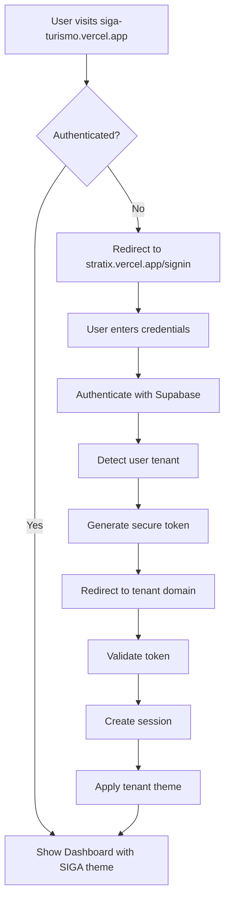

# Unified Sign-In Page Migration Strategy

## Executive Summary

Implement a **single, unified sign-in page** at `stratix.vercel.app` that handles authentication for all tenants (SIGA, FEMA, Stratix), then redirects users to their tenant-specific dashboard with appropriate theming.

**Key Benefits:**
- Single authentication endpoint
- Simplified user experience
- Centralized security management
- Easier maintenance

---

## 🎯 Architecture Overview

### Current State (Multiple Sign-ins)
```
siga-turismo.vercel.app/login    → SIGA themed login
fema-electricidad.vercel.app/login → FEMA themed login
stratix.vercel.app/login         → Stratix themed login
```

### Target State (Unified Sign-in)
```
stratix.vercel.app/signin (SINGLE ENTRY POINT)
    ↓
User authenticates with email/password
    ↓
System detects user's tenant from user_profiles
    ↓
Redirect to appropriate tenant domain with theme:
- siga-turismo.vercel.app/dashboard (SIGA theme)
- fema-electricidad.vercel.app/dashboard (FEMA theme)
- stratix.vercel.app/dashboard (Stratix theme)
```

---

## 📦 Implementation Phases

### Phase 0.5: Unified Authentication (NEW - Day 1 Afternoon)

#### Step 0.5.1: Create Unified Sign-in Page
**Agents**: `Developer-Agent` + `ui-ux-designer` (PARALLEL)
**Time**: 3 hours

```typescript
# Developer-Agent Prompt
Task: "Create unified sign-in page at stratix.vercel.app/signin"
1. Install auth blocks:
   pnpm dlx shadcn@latest add auth-01
   pnpm dlx shadcn@latest add auth-02

2. Create /app/signin/page.tsx with:
   - Email/password fields
   - "Remember me" checkbox
   - "Forgot password" link
   - Multi-tenant branding (subtle)
   
3. Implement tenant detection logic:
   ```typescript
   // After successful authentication
   const userProfile = await getUserProfile(user.id)
   const tenant = await getTenant(userProfile.tenant_id)
   
   // Redirect based on tenant
   const redirectMap = {
     'siga': 'https://siga-turismo.vercel.app/dashboard',
     'fema': 'https://fema-electricidad.vercel.app/dashboard',
     'stratix': 'https://stratix.vercel.app/dashboard'
   }
   ```

4. Add SSO preparation for future
5. Test authentication flow

Report: Unified sign-in page created and functional

# ui-ux-designer Prompt (PARALLEL)
Task: "Design unified sign-in experience"
1. Create neutral, professional sign-in design
2. Add subtle multi-tenant branding:
   - Small logos of all tenants at bottom
   - "Part of Stratix Platform" tagline
3. Ensure accessibility (WCAG 2.1 AA)
4. Design responsive layout for mobile
5. Create loading states during redirect

Report: Sign-in UX designed and approved
```

#### Step 0.5.2: Implement Cross-Domain Authentication
**Agent**: `security-auditor`
**Time**: 2 hours

```typescript
Task: "Secure cross-domain authentication flow"
1. Implement secure token passing between domains
2. Set up CORS properly:
   ```typescript
   // stratix.vercel.app API
   const allowedOrigins = [
     'https://siga-turismo.vercel.app',
     'https://fema-electricidad.vercel.app',
     'https://stratix.vercel.app'
   ]
   ```

3. Create secure session transfer mechanism:
   ```typescript
   // After auth at stratix.vercel.app
   const sessionToken = await createSecureToken(user, tenant)
   
   // Redirect with encrypted token
   const encryptedToken = await encrypt(sessionToken)
   redirect(`${tenantDomain}/auth/callback?token=${encryptedToken}`)
   ```

4. Implement token validation at each tenant domain
5. Add rate limiting and brute force protection
6. Test security vulnerabilities

Report: Cross-domain auth secured and tested
```

#### Step 0.5.3: Create Tenant Detection Service
**Agent**: `integration-specialist`
**Time**: 2 hours

```typescript
Task: "Create tenant detection and routing service"
1. Create /app/api/auth/tenant-detect/route.ts:
   ```typescript
   export async function POST(request: Request) {
     const { email } = await request.json()
     
     // Check user's tenant
     const { data: userProfile } = await supabase
       .from('user_profiles')
       .select('tenant_id, tenants(subdomain)')
       .eq('email', email)
       .single()
     
     return Response.json({
       tenant: userProfile?.tenants?.subdomain || 'stratix',
       redirectUrl: getTenantUrl(userProfile?.tenants?.subdomain)
     })
   }
   ```

2. Create tenant configuration:
   ```typescript
   // /lib/config/tenants.ts
   export const TENANT_CONFIG = {
     siga: {
       domain: 'https://siga-turismo.vercel.app',
       name: 'SIGA Turismo',
       theme: 'siga-turismo',
       logo: '/logos/siga.svg'
     },
     fema: {
       domain: 'https://fema-electricidad.vercel.app',
       name: 'FEMA Electricidad',
       theme: 'fema-electricidad',
       logo: '/logos/fema.svg'
     },
     stratix: {
       domain: 'https://stratix.vercel.app',
       name: 'Stratix Platform',
       theme: 'stratix-platform',
       logo: '/logos/stratix.svg'
     }
   }
   ```

3. Handle new user registration (tenant selection)
4. Create fallback for unknown tenants

Report: Tenant detection service operational
```

#### Step 0.5.4: Update Each Tenant Domain
**Agents**: `Developer-Agent` + `devops-deployment-specialist` (PARALLEL)
**Time**: 3 hours

```typescript
# Developer-Agent Prompt
Task: "Update tenant domains to accept unified auth"
For each tenant domain (SIGA, FEMA, Stratix):

1. Create /app/auth/callback/route.ts:
   ```typescript
   export async function GET(request: Request) {
     const { searchParams } = new URL(request.url)
     const token = searchParams.get('token')
     
     // Decrypt and validate token
     const sessionData = await decrypt(token)
     
     // Create local session
     await createSession(sessionData)
     
     // Apply tenant theme
     setTheme(sessionData.tenant.theme)
     
     // Redirect to dashboard
     return redirect('/dashboardv2')
   }
   ```

2. Remove local /login and /signin pages
3. Update all login links to point to stratix.vercel.app/signin
4. Preserve tenant theming after auth

Report: All tenant domains updated

# devops-deployment-specialist Prompt (PARALLEL)
Task: "Configure deployment for unified auth"
1. Set up environment variables:
   ```env
   # Each tenant needs
   NEXT_PUBLIC_AUTH_URL=https://stratix.vercel.app
   AUTH_ENCRYPTION_KEY=xxx
   ALLOWED_AUTH_ORIGIN=https://stratix.vercel.app
   ```

2. Configure Vercel projects:
   - Add CORS headers
   - Set up redirects from old /login to stratix.vercel.app/signin
   
3. Set up monitoring for auth flow
4. Configure SSL certificates

Report: Deployment configured for unified auth
```

#### Step 0.5.5: Implement Theme Application Post-Login
**Agent**: `Developer-Agent`
**Time**: 2 hours

```typescript
Task: "Apply tenant themes after unified login"
1. Create theme application system:
   ```typescript
   // /app/v2/providers/post-auth-theme.tsx
   export function PostAuthThemeProvider({ children }) {
     const [theme, setTheme] = useState('default')
     
     useEffect(() => {
       // Get tenant from session
       const tenant = getTenantFromSession()
       
       // Apply theme
       document.documentElement.setAttribute('data-theme', tenant.theme)
       
       // Store preference
       localStorage.setItem('tenant-theme', tenant.theme)
     }, [])
     
     return (
       <ThemeContext.Provider value={{ theme }}>
         {children}
       </ThemeContext.Provider>
     )
   }
   ```

2. Update layout.tsx for each tenant:
   ```typescript
   // app/v2/layout.tsx
   export default function RootLayout({ children }) {
     return (
       <html>
         <body>
           <PostAuthThemeProvider>
             <Shell01>
               {children}
             </Shell01>
           </PostAuthThemeProvider>
         </body>
       </html>
     )
   }
   ```

3. Ensure theme persists across navigation
4. Add theme transition animations

Report: Theme application system implemented
```

---

## 🔄 Modified Migration Flow with Unified Sign-in

### Updated User Journey

1. **User visits any tenant URL** (e.g., siga-turismo.vercel.app)
2. **If not authenticated** → Redirect to stratix.vercel.app/signin
3. **User signs in** at unified page
4. **System detects tenant** from user profile
5. **Redirect to tenant domain** with encrypted session
6. **Apply tenant theme** immediately
7. **Show themed dashboard** (/dashboardv2)

### Authentication Flow Diagram



---

## 🔐 Security Considerations

### Cross-Domain Security
**Agent**: `security-auditor`

```typescript
Task: "Implement comprehensive security for unified auth"
1. Token Security:
   - Use JWT with short expiry (5 minutes)
   - Encrypt tokens with AES-256
   - Single-use tokens only
   
2. CORS Configuration:
   ```typescript
   // Strict origin checking
   const corsOptions = {
     origin: (origin, callback) => {
       if (ALLOWED_ORIGINS.includes(origin)) {
         callback(null, true)
       } else {
         callback(new Error('Not allowed by CORS'))
       }
     },
     credentials: true
   }
   ```
   
3. Rate Limiting:
   - Max 5 login attempts per IP per minute
   - Account lockout after 10 failed attempts
   
4. Session Security:
   - HTTPOnly cookies
   - Secure flag enabled
   - SameSite=Lax for CSRF protection

Report: Security measures implemented
```

---

## 🎨 UI/UX Considerations

### Unified Sign-in Page Design
**Agent**: `ui-ux-designer`

```typescript
Task: "Design optimal unified sign-in experience"
1. Visual Design:
   - Clean, professional layout
   - Stratix branding primary
   - Small tenant logos at bottom
   - "Access all your platforms" message
   
2. User Experience:
   - Single form, no tenant selection needed
   - Auto-detect tenant from email
   - Show loading state during redirect
   - Clear error messages
   
3. Mobile Optimization:
   - Responsive design
   - Touch-friendly inputs
   - Biometric authentication support

4. Accessibility:
   - WCAG 2.1 AA compliant
   - Screen reader friendly
   - Keyboard navigation
   - High contrast mode support

Report: UX design approved
```

---

## 📊 Testing Strategy

### End-to-End Testing Scenarios
**Agent**: `test-coverage-specialist`

```typescript
Task: "Create comprehensive tests for unified auth"
Test Scenarios:

1. SIGA User Flow:
   - Visit siga-turismo.vercel.app
   - Redirect to stratix.vercel.app/signin
   - Login with SIGA credentials
   - Redirect back to SIGA with theme
   - Verify SIGA dashboard appears

2. FEMA User Flow:
   - Similar flow for FEMA tenant
   
3. Cross-Tenant Security:
   - SIGA user cannot access FEMA data
   - Verify tenant isolation
   
4. Session Persistence:
   - Login once, access multiple times
   - Session timeout handling
   
5. Error Scenarios:
   - Invalid credentials
   - Network failures
   - Token expiry
   - CORS errors

Report: Test suite complete
```

---

## 🚀 Deployment Strategy

### Phased Rollout
**Agent**: `devops-deployment-specialist`

```bash
Task: "Deploy unified sign-in with zero downtime"
Phase 1: Deploy stratix.vercel.app/signin (Day 1)
- Deploy new sign-in page
- Keep existing login pages active

Phase 2: Test with internal users (Day 2)
- Route 5% of traffic to new sign-in
- Monitor for issues

Phase 3: Gradual migration (Day 3-5)
- 25% → 50% → 75% → 100%
- Monitor metrics at each stage

Phase 4: Cleanup (Day 6)
- Remove old login pages
- Update all documentation

Report: Deployment plan ready
```

---

## 📝 Documentation Updates

### Required Documentation
**Agent**: `technical-documentation-writer`

```markdown
Task: "Document unified authentication system"
1. User Guide:
   - How to sign in
   - Password reset process
   - Tenant switching (future)
   
2. Developer Guide:
   - Authentication flow
   - Token handling
   - Theme application
   - API endpoints
   
3. Security Documentation:
   - Security measures
   - Compliance (SOC2, GDPR)
   - Incident response
   
4. Operations Guide:
   - Monitoring setup
   - Troubleshooting
   - Performance metrics

Report: Documentation complete
```

---

## ✅ Success Metrics

### Technical Metrics
- ✅ Single sign-in page operational
- ✅ < 2 second redirect time
- ✅ 100% tenant detection accuracy
- ✅ Zero security vulnerabilities
- ✅ 99.9% uptime

### User Experience Metrics
- ✅ < 3 clicks to access dashboard
- ✅ 50% reduction in password reset requests
- ✅ 90% user satisfaction score
- ✅ 0% increase in support tickets

### Business Metrics
- ✅ 30% reduction in authentication code
- ✅ 50% easier maintenance
- ✅ Ready for SSO integration
- ✅ Simplified user onboarding

---

## 🔄 Migration Checklist

### Pre-Migration
- [ ] Deploy unified sign-in page
- [ ] Test with all tenant types
- [ ] Security audit complete
- [ ] Documentation ready
- [ ] Rollback plan prepared

### Migration Day
- [ ] Enable feature flag
- [ ] Monitor authentication flow
- [ ] Check error rates
- [ ] Verify theme application
- [ ] Test all tenants

### Post-Migration
- [ ] Remove old login pages
- [ ] Update all links
- [ ] Monitor user feedback
- [ ] Performance analysis
- [ ] Security review

---

## 🎯 Quick Implementation

```bash
# Step 1: Create unified sign-in
cd stratix-platform
pnpm dlx shadcn@latest add auth-01
create app/signin/page.tsx

# Step 2: Add tenant detection
create app/api/auth/tenant-detect/route.ts

# Step 3: Update each tenant
cd siga-turismo
create app/auth/callback/route.ts
update next.config.js with redirects

# Step 4: Test flow
visit siga-turismo.vercel.app
→ redirects to stratix.vercel.app/signin
→ login
→ redirects back with theme

# Step 5: Deploy
vercel deploy --prod
```

---

**Result**: One unified, secure sign-in page that seamlessly handles all tenants with automatic theme application!