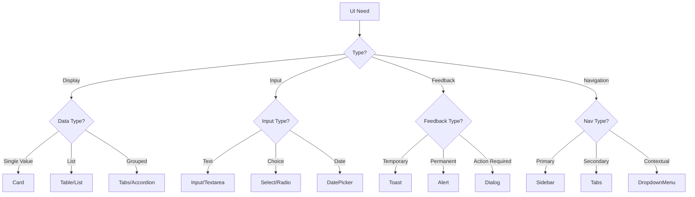

# Component Selection Guide for Initiative Dashboard

## How to Select shadcn/ui Components

When building a new feature or redesigning an existing one, follow this selection process:

## 1. Analyze UI Requirements

### Questions to Ask:
- What type of data are we displaying? (list, grid, form, metrics)
- What interactions are needed? (click, hover, drag, select)
- What states must be handled? (loading, error, empty, success)
- What's the information hierarchy? (primary, secondary, supporting)
- What responsive behavior is needed?

## 2. Map Requirements to Components

### For Data Display:
```json
{
  "metrics": ["Card", "Progress", "Badge"],
  "lists": ["Table", "Card", "ScrollArea"],
  "details": ["Card", "Tabs", "Accordion"],
  "comparisons": ["Table", "Chart"],
  "status": ["Badge", "Alert", "Progress"]
}
```

### For User Input:
```json
{
  "text": ["Input", "Textarea"],
  "selection": ["Select", "RadioGroup", "Checkbox"],
  "dates": ["DatePicker", "Calendar"],
  "files": ["Input[type=file]", "Dropzone"],
  "toggles": ["Switch", "Checkbox"]
}
```

### For Feedback:
```json
{
  "notifications": ["Toast", "Alert"],
  "confirmations": ["AlertDialog", "Dialog"],
  "loading": ["Skeleton", "Spinner"],
  "errors": ["Alert", "Toast"],
  "success": ["Toast", "Alert"]
}
```

### For Navigation:
```json
{
  "menus": ["NavigationMenu", "DropdownMenu"],
  "tabs": ["Tabs"],
  "breadcrumbs": ["Breadcrumb"],
  "pagination": ["Pagination"],
  "links": ["Button[variant=link]", "Link"]
}
```

## 3. Component Selection Matrix

| Use Case | Primary Component | Secondary Options | Avoid |
|----------|------------------|-------------------|-------|
| Dashboard Cards | Card | - | Table |
| KPI Metrics | Card + Badge | Alert | Dialog |
| Data Lists | Table | Card Grid | Plain divs |
| Forms | Form + Input | Dialog wrapper | Inline editing |
| Filters | Select + Button | Popover | Modal |
| Actions | Button | DropdownMenu | Links |
| Status | Badge | Alert | Text only |
| Progress | Progress | Badge | Plain text |
| Date Selection | DatePicker | Calendar | Text input |
| Confirmations | AlertDialog | Dialog | Browser confirm |
| Notifications | Toast | Alert | Modal |
| Loading | Skeleton | Spinner | No indicator |
| Navigation | Sidebar | NavigationMenu | Dropdown only |

## 4. Component Composition Patterns

### Pattern 1: Dashboard Card
```typescript
Card
├── CardHeader
│   ├── CardTitle
│   └── Badge (status)
├── CardContent
│   ├── Progress
│   └── DataDisplay
└── CardFooter
    └── Button (actions)
```

### Pattern 2: Data Table
```typescript
Card
├── CardHeader
│   ├── CardTitle
│   └── Button (add new)
├── CardContent
│   └── Table
│       ├── TableHeader
│       └── TableBody
└── CardFooter
    └── Pagination
```

### Pattern 3: Form Modal
```typescript
Dialog
├── DialogTrigger (Button)
└── DialogContent
    ├── DialogHeader
    │   └── DialogTitle
    ├── Form
    │   ├── FormField
    │   │   ├── FormLabel
    │   │   ├── FormControl (Input/Select)
    │   │   └── FormMessage
    │   └── [...more fields]
    └── DialogFooter
        ├── Button (cancel)
        └── Button (submit)
```

### Pattern 4: Filter Bar
```typescript
div (flex container)
├── Select (status)
├── Select (category)
├── DatePicker (range)
├── Input (search)
└── Button (apply/reset)
```

## 5. Decision Tree for Component Selection



## 6. Component Props Checklist

When implementing a selected component, ensure:

- [ ] **Styling**: className with cn() utility
- [ ] **Variants**: Choose appropriate variant (default, outline, ghost, etc.)
- [ ] **Size**: Select size (sm, default, lg)
- [ ] **State**: Handle disabled, loading, error states
- [ ] **Accessibility**: Add aria-labels, roles
- [ ] **Responsive**: Include responsive classes
- [ ] **Theme**: Apply glassmorphic classes
- [ ] **Animation**: Add transitions where appropriate

## 7. Example Component Selection

### Scenario: Objectives Dashboard

```json
{
  "sections": [
    {
      "name": "KPI Row",
      "components": [
        {
          "primary": "Card",
          "variant": "glassmorphic",
          "height": "h-24",
          "contains": ["Badge", "TrendIcon"],
          "grid": "grid-cols-4"
        }
      ]
    },
    {
      "name": "Filters Bar",
      "components": [
        {
          "primary": "div",
          "className": "flex gap-4",
          "contains": [
            "Select (status)",
            "Select (department)",
            "DateRangePicker",
            "Button (primary)"
          ]
        }
      ]
    },
    {
      "name": "Objectives Grid",
      "components": [
        {
          "primary": "Card",
          "variant": "glassmorphic",
          "minHeight": "min-h-[200px]",
          "contains": [
            "CardHeader (title, badge)",
            "CardContent (progress, description)",
            "CardFooter (buttons)"
          ],
          "grid": "grid-cols-3"
        }
      ]
    },
    {
      "name": "Empty State",
      "components": [
        {
          "primary": "Card",
          "className": "text-center p-8",
          "contains": [
            "Icon",
            "Heading",
            "Description",
            "Button (CTA)"
          ]
        }
      ]
    }
  ]
}
```

## 8. Anti-Patterns to Avoid

❌ **Don't:**
- Use Table for card layouts
- Use Dialog for notifications (use Toast)
- Use multiple Dialogs stacked
- Mix component libraries
- Create custom components when shadcn has one
- Use inline styles instead of Tailwind classes
- Forget loading and error states
- Skip accessibility attributes

✅ **Do:**
- Use consistent components across similar features
- Compose simple components for complex UI
- Follow the design system spacing
- Include all interactive states
- Test on all breakpoints
- Use TypeScript for props
- Implement keyboard navigation
- Add proper ARIA labels

## 9. Performance Considerations

When selecting components, consider:

1. **Bundle Size**: Prefer lighter components when possible
2. **Render Performance**: Use virtualization for long lists
3. **Animation**: Use CSS transitions over JS animations
4. **Lazy Loading**: Split code for modals and heavy components
5. **Memoization**: Use React.memo for expensive components

## 10. Testing Component Selection

Validate your component choices:

1. **Functionality**: Does it handle all use cases?
2. **Accessibility**: Can it be used with keyboard only?
3. **Responsiveness**: Does it work on all screen sizes?
4. **Performance**: Is interaction under 100ms?
5. **Consistency**: Does it match other similar UI?
6. **Maintainability**: Is it easy to update?
7. **User Experience**: Is it intuitive to use?